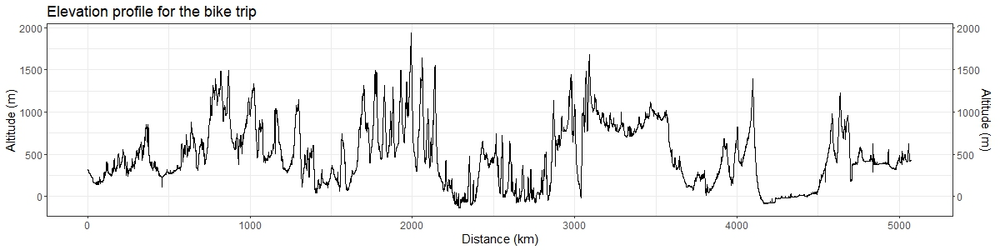
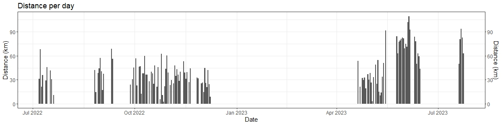
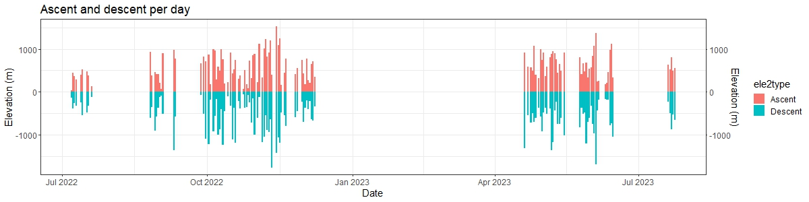

<html>
	<head>
	
	<title>A Leaflet map!</title>
	
	
	<!-- Browserify	 --> 
    	<!--  -->

	<!-- leaflet -->
    	<link rel="stylesheet" href="js/node_modules/leaflet/dist/leaflet.css" />
    	

    	<!-- gpx.min -->
    	<!-- Copyright (C) 2013 Maxime Petazzoni <maxime.petazzoni@bulix.org> -->
    	<!--  -->
    	

	<!-- hash -->
	<!-- A JavaScript library that keeps track of the history of changes to the hash part in the address bar. -->
    	

    	<!-- fullscreen -->
		<!-- Not in npm -->
		<!-- Not in npm -->
		<!-- Not in npm -->
    	
    	<link href='js/node_modules/leaflet.fullscreen/Control.FullScreen.css' rel='stylesheet' />

    	<!-- GeoJSON.Ajax -->
	<!-- to update with https://www.npmjs.com/package/leaflet-ajax -->
	<!-- to update with https://www.npmjs.com/package/leaflet-ajax -->
	<!-- to update with https://www.npmjs.com/package/leaflet-ajax -->
	<!-- to update with https://www.npmjs.com/package/leaflet-ajax -->
	<!-- to update with https://www.npmjs.com/package/leaflet-ajax -->
	<!-- to update with https://www.npmjs.com/package/leaflet-ajax -->
	<!-- to update with https://www.npmjs.com/package/leaflet-ajax -->
	<!-- to update with https://www.npmjs.com/package/leaflet-ajax -->
	<!-- to update with https://www.npmjs.com/package/leaflet-ajax -->
    	<link  href="js/GeoJSON.Ajax/GeoJSON.Style.css" rel="stylesheet" />
    	
    	
    	

	<!-- Minimap -->
	<!-- https://github.com/Norkart/Leaflet-MiniMap
	Copyright (c) 2012, Norkart AS
	All rights reserved. -->
	
	<link  href="js/node_modules/leaflet-minimap/src/Control.MiniMap.css" rel="stylesheet"/>

	<!-- topcenter -->
	<!-- Not in npm -->
	<!-- Not in npm -->
	<!-- Not in npm -->
	<!-- Not in npm -->
	<link  href="js/topcenter/leaflet-control-topcenter.css" rel="stylesheet"/>
	

	<!-- geocoder -->
	<link rel="stylesheet" href="js/node_modules/leaflet-control-geocoder/dist/Control.Geocoder.css" />
	

	<!-- leaflet-routing-machine -->
	<!-- browserify leaflet-routing-machine.js -o leaflet-routing-machine2.js -->
	
	<link rel="stylesheet" href="js/node_modules/leaflet-routing-machine/dist/leaflet-routing-machine.css" />

	<!-- lrm-graphhopper -->
	<!-- Run in cmd: -->
	<!-- C:\Users\doria\Downloads\GitHub\dorian.gravier.github.io\js\node_modules\lrm-graphhopper\src > browserify L.Routing.GraphHopper.js -o L.Routing.GraphHopper2.js -->
	

	<!-- FileLayer -->
	
	
	<!-- Leaflet.PolylineMeasure -->
	<link rel="stylesheet" href="https://ppete2.github.io/Leaflet.PolylineMeasure/Leaflet.PolylineMeasure.css" />
	
		<!-- need those to download track -->
		
		

    	<!-- Personal js -->
    	<!--  -->
    	<!--  -->
    	
    	
    	
    	

    	

    </head>
    <body>

    	 
    	<!-- To display the map -->
    	

    	 
    	 

    	
		
	<table>
		<tr style="background-color:#424242;">
			<th>

</th>	
			<th>People visited</th>	
		</tr>
		<tr>
			<th>

</th>
			<th>Nice areas</th>	
		</tr>
		<tr>
			<th>

</th>
			<th>Climbing spot where I climbed</th>	
		</tr>
	</table>

	

	 
	

	 
	

	 
	

	 
	 
	Those videos are not listed in Youtube. They only work via the link I use or share. Please be conscious if you share this.
	 
	 
	
	
	
	
	
	

	<iframe src="https://youtube.com/embed/DOAFBsOLxU8" title="Etape 1"></iframe>

	<iframe src="https://youtube.com/embed/8LHpj548vwQ" title="Etape 2"></iframe>

	<iframe src="https://youtube.com/embed/c3TYsR0lHm4" title="Etape 3"></iframe>

	<iframe src="https://youtube.com/embed/dGs5OAm9UjM" title="Etape 4"></iframe>

	<iframe src="https://youtube.com/embed/FazzpMo_XLw" title="Etape 5"></iframe>

	<iframe src="https://youtube.com/embed/Dhl7j1CuSw8" title="Etape 6"></iframe>

	<iframe src="https://youtube.com/embed/1sCZ6ZP0oUE" title="Etape 7"></iframe>
	

		
		
    </body>

</html>

