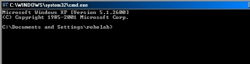
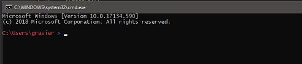
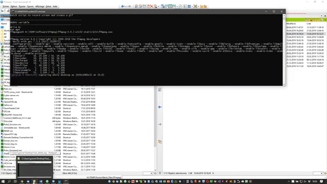

<!-- TOC -->

- [Batch](#batch)
	- [Change color console](#change-color-console)
	- [Get system info](#get-system-info)
		- [OS bits](#os-bits)
		- [OS version](#os-version)
		- [Format date or time](#format-date-or-time)
		- [Get timestamp](#get-timestamp)
	- [Magick](#magick)
		- [Merge in batch](#merge-in-batch)
		- [Resize in batch](#resize-in-batch)
		- [Level brightness](#level-brightness)
		- [flex files to tiff](#flex-files-to-tiff)
	- [FFmpeg](#ffmpeg)
		- [Record screen and audio](#record-screen-and-audio)
		- [Record screen and convert into gif](#record-screen-and-convert-into-gif)
	- [Add variable to system variable PATH (Windows)](#add-variable-to-system-variable-path-windows)
	- [Right click delete fast a folder (do not have to wait to continue to work)](#right-click-delete-fast-a-folder-do-not-have-to-wait-to-continue-to-work)
- [R](#r)
	- [data.table tricks](#datatable-tricks)
		- [Add last row as colnames for html](#add-last-row-as-colnames-for-html)
		- [Create group ID or row ID](#create-group-id-or-row-id)
		- [Max of a variable per group of variable](#max-of-a-variable-per-group-of-variable)
		- [Calculation per group, by](#calculation-per-group-by)
		- [Best 3 of a variable per group of variable (same variante as before but for DRC, meaning take the 3 best plates per CP)](#best-3-of-a-variable-per-group-of-variable-same-variante-as-before-but-for-drc-meaning-take-the-3-best-plates-per-cp)
		- [Modify multiples columns at the same time](#modify-multiples-columns-at-the-same-time)
		- [Order columns](#order-columns)
		- [Summarize table depending on BY and .SDcols](#summarize-table-depending-on-by-and-sdcols)
		- [Replace all values conditionnaly](#replace-all-values-conditionnaly)
		- [sum of all previous row by a variable](#sum-of-all-previous-row-by-a-variable)
		- [Access data.table with string](#access-datatable-with-string)
		- [find duplicated value in data.table](#find-duplicated-value-in-datatable)
	- [Dose Response Curve](#dose-response-curve)
- [Youtube-dl](#youtube-dl)
	- [Easy Commands](#easy-commands)
	- [Batch](#batch-1)
- [Leaflet](#leaflet)
	- [Gpx](#gpx)
		- [Load multiple gpx](#load-multiple-gpx)
		- [Popup on click](#popup-on-click)
		- [Popup on mouseover](#popup-on-mouseover)
		- [Highlight or change color on mouseover](#highlight-or-change-color-on-mouseover)
- [Other](#other)
	- [Add context menu (right clik) for files](#add-context-menu-right-clik-for-files)
- [HTML](#html)
	- [Image adjustement via css filter and slider](#image-adjustement-via-css-filter-and-slider)
- [Office](#office)
	- [Add a context menu to right click export to pdf](#add-a-context-menu-to-right-click-export-to-pdf)

<!-- /TOC -->


# Batch

## Delete files via a regex

- Open the batch file
- Give the path in string
- Give your regex
- The batch will print the list of file and tell you how many file it will delete, ask user yes or no

```shell
@echo off

set /p dirpath=Where are your files ?
:: set dirpath=%~dp0 :: if you want to use the directory where the batch file is
set /p pattern=Which pattern do you wanna search (use regex: *.xml e.g.) :
:: combinason /s /b for fullpath+filename, /b for filename
for /f %%A in ('dir /s /b "%dirpath%\%pattern%" ^| find /v /c ""') do set cnt=%%A
echo File count = %cnt%

call :MsgBox "Do you want to delete all %pattern% in %dirpath%? %cnt% files found"  "VBYesNo+VBQuestion" "Click yes to delete the %pattern%"
if errorlevel 7 (
	echo NO - quit the batch file
) else if errorlevel 6 (
	echo YES - delete the files
	:: set you regex, %%i in batch file, % in cmd
	for /f "delims=" %%a in ('dir /s /b "%dirpath%\%pattern%"') do del "%%a"
)

:: avoid little window to popup
exit /b

:: VBS code for the yesNo popup
:MsgBox prompt type title
    setlocal enableextensions
    set "tempFile=%temp%\%~nx0.%random%%random%%random%vbs.tmp"
    >"%tempFile%" echo(WScript.Quit msgBox("%~1",%~2,"%~3") & cscript //nologo //e:vbscript "%tempFile%"
    set "exitCode=%errorlevel%" & del "%tempFile%" >nul 2>nul
    endlocal & exit /b %exitCode%

```

## Change color console

I created a batch file to change the color of the windows cmd windows. It is using [Ansicon](https://github.com/adoxa/ansicon).
The goal is to make the console a bit more clear: You can see you self the difference :




The batch file is checking which OS you have:

- 32 or 64bits, to know which .exe to install
- XP or above, to adapt the way to write the 'promptx' variable

The only things that you have to do is adapt where you exe is and if needed change the color and the output in the prompt :
 "$e[1;31m$p$s$e[1;34m$g$s$e[1;37m"
 
 
 
 ]


```shell
reg Query "HKLM\Hardware\Description\System\CentralProcessor\0" | find /i "x86" > NUL && set OS=32BIT || set OS=64BIT
systeminfo | findstr /B /C:"OS Name" /C:"OS Version" | find /i "XP" > NUL && set ver=XP || set ver=other
if %OS%==32BIT (
	if exist H:\ (
		H:
		H:\TEMP\Software\ansi186\x86\ansicon.exe -i
	) else (
		X:
		X:\TEMP\Software\ansi186\x86\ansicon.exe -i
	)
)
if %OS%==64BIT (
	if exist H:\ (
		H:
		H:\TEMP\Software\ansi186\x64\ansicon.exe -i
	) else (
		X:
		X:\TEMP\Software\ansi186\x64\ansicon.exe -i
	)
)

if %ver%==XP (
	reg add HKCU\Environment /v PROMPT /d "$e[1;31m$p$s$e[1;34m$g$s$e[1;37m" /f
) else (
	setx prompt $e[1;31m$p$s$e[1;34m$g$s$e[1;37m
)

```

## Get system info

### OS bits

```shell
reg Query "HKLM\Hardware\Description\System\CentralProcessor\0" | find /i "x86" > NUL && set OS=32BIT || set OS=64BIT
if %OS%==32BIT (
	echo 32bits
) else (
	echo 64bits
)
```
### OS version

```shell
systeminfo | findstr /B /C:"OS Name" /C:"OS Version" | find /i "XP" > NUL && set ver=XP || set ver=other
echo %ver%
```

### Format date or time

If the input locale is englisch the month and day are reversed.
Here a solution to get it right.

```shell
systeminfo | findstr /B /C:"Input Locale:" | find /i "de;" > NUL && set lan=de || set lan=en
if %lan%==de (
	set month=%date:~-7,2%
	set day=%date:~-10,2%
) else (
	set day=%date:~-7,2%
	set month=%date:~-10,2%
)
```

### Get timestamp

```shell
:: ---------- Find Time ----------
set hour=%time:~0,2%
if "%hour:~0,1%" == " " set hour=0%hour:~1,1%
set min=%time:~3,2%
if "%min:~0,1%" == " " set min=0%min:~1,1%
::set secs=%time:~6,2%
::if "%secs:~0,1%" == " " set secs=0%secs:~1,1%

set year=%date:~-4%
systeminfo | findstr /B /C:"Input Locale:" | find /i "de;" > NUL && set lan=de || set lan=en
if %lan%==de (
	set month=%date:~-7,2%
	set day=%date:~-10,2%
) else (
	set day=%date:~-7,2%
	set month=%date:~-10,2%
)
if "%month:~0,1%" == " " set month=0%month:~1,1%
if "%day:~0,1%" == " " set day=0%day:~1,1%
set datetimef=%year%%month%%day%%hour%%min%
```

## Magick

### Merge in batch

MAGICK_Merge_Vertical_jpg-png_v02.bat

```shell
@echo off
SETLOCAL ENABLEDELAYEDEXPANSION

set /p which="Do you want to merge jpg (type 1) or png (type 2) ? : "

if %which%==1 set format="jpg"
if %which%==2 set format="png"

set /p per=percent to resize (numeric) (make a copy it will overwrite your files)?:

echo Choose where your jpg are (choose 1 file):


:: file choose and get dir
set dialog="about:<input type=file id=FILE><script>FILE.click();new ActiveXObject
set dialog=%dialog%('Scripting.FileSystemObject').GetStandardStream(1).WriteLine(FILE.value);
set dialog=%dialog%close();resizeTo(0,0);</script>"

for /f "tokens=* delims=" %%p in ('mshta.exe %dialog%') do set "input=%%p"
for /F %%i in ("%input%") do @set dir=%%~dpi
for /F %%i in ("%input%") do @set drive=%%~di

%drive%
cd "%dir%"

:: give info on what will be done
dir /a-d /b "*%format%" | find /c %format% > temp
set /p nfiles= < temp
::set /a nfiles=nfiles
del temp

:: resize
for %%p in (*.%format%) do magick convert %%p -resize %per%%% %%p


:: Merge
magick montage *.%format% -tile 1x%nfiles% -geometry +0+0 Merge.%format%
magick convert Merge.%format% Merge.pdf

echo DEBUG --------------------------
echo drive %drive%
echo dir %dir%
echo which %which%
echo format %format%
echo magick montage *.%format% -tile 1x%nfiles% -geometry +0+0 Merge.%format%
echo magick convert Merge.%format% Merge.pdf

```


### Resize in batch

MAGICK_Resize_v01.bat

```shell
@echo off
SETLOCAL ENABLEDELAYEDEXPANSION

set /p which="Do you want to merge jpg (type 1) or png (type 2) ? : "

if %which%==1 set format="jpg"
if %which%==2 set format="png"

set /p per=percent to resize (numeric) ?:

echo Choose where your files are (choose 1 file):

:: file choose and get dir
set dialog="about:<input type=file id=FILE><script>FILE.click();new ActiveXObject
set dialog=%dialog%('Scripting.FileSystemObject').GetStandardStream(1).WriteLine(FILE.value);
set dialog=%dialog%close();resizeTo(0,0);</script>"

for /f "tokens=* delims=" %%p in ('mshta.exe %dialog%') do set "input=%%p"
for /F %%i in ("%input%") do @set dir=%%~dpi
for /F %%i in ("%input%") do @set drive=%%~di

%drive%
cd "%dir%"

:: give info on what will be done
dir /a-d /b "*%format%" | find /c %format% > temp
set /p nfiles= < temp
::set /a nfiles=nfiles
del temp

for %%p in (*.%format%) do magick convert %%p -resize %per%%% %%~np_low.%format%


```

### Level brightness

```shell
@echo off
SETLOCAL ENABLEDELAYEDEXPANSION

echo Choose where your jpg files are (choose 1 jpg):

:: file choose and get dir
set dialog="about:<input type=file id=FILE><script>FILE.click();new ActiveXObject
set dialog=%dialog%('Scripting.FileSystemObject').GetStandardStream(1).WriteLine(FILE.value);
set dialog=%dialog%close();resizeTo(0,0);</script>"

for /f "tokens=* delims=" %%p in ('mshta.exe %dialog%') do set "input=%%p"
for /F %%i in ("%input%") do @set dir=%%~dpi
for /F %%i in ("%input%") do @set drive=%%~di

%drive%
cd %dir%


:: User input number of channel

set /p channel="At which level do you wanna set the white point ? (20 mean 20 percent of the actual, just test and MAKE A COPY OF YOUR FILE) : "
set /a channel=channel

:: give info on what will be done
dir /a-d /b "*jpg" | find /c "jpg" > temp
set /p nfiles= < temp
set /a nfiles=nfiles
set /a xfile=1
del temp

set /p tt=%nfiles% jpg will be processed, type Enter to continue.


:: convert in tiff and rename it
FOR /F "delims=" %%a IN ('dir /a-d /b "*jpg"') DO (
	H:\TEMP\Software\ImageMagick-7.0.8-Q16\magick.exe convert %%a -level "0%%,%channel%%%,1" %%a
	echo 1 more done ...
)

```

### flex files to tiff


```shell
@echo off
SETLOCAL ENABLEDELAYEDEXPANSION

echo Choose where your flex files are (choose 1 flex):

:: file choose and get dir
set dialog="about:<input type=file id=FILE><script>FILE.click();new ActiveXObject
set dialog=%dialog%('Scripting.FileSystemObject').GetStandardStream(1).WriteLine(FILE.value);
set dialog=%dialog%close();resizeTo(0,0);</script>"

for /f "tokens=* delims=" %%p in ('mshta.exe %dialog%') do set "input=%%p"
for /F %%i in ("%input%") do @set dir=%%~dpi
for /F %%i in ("%input%") do @set drive=%%~di

%drive%
cd %dir%
mkdir TIFF

:: User input number of channel

set /p channel="How many Channel you have ? "
set /a channel=channel

:: give info on what will be done
dir /a-d /b "*flex" | find /c "flex" > temp
set /p nfiles= < temp
set /a nfiles=nfiles
set /a xfile=1
del temp

set /p tt=%nfiles% flex will be processed, type Enter to continue.


:: convert in tiff and rename it
FOR /F "delims=" %%a IN ('dir /a-d /b "*flex"') DO (
	H:\TEMP\Software\ImageMagick-7.0.8-Q16\magick.exe convert %%a -set filename:f "%%t_%%s" +adjoin "TIFF\%%[filename:f].tif"
	dir /b "*.tif" | find /c "%%~na" > temp
	set /p howmany= < temp
	set /a howmany=!howmany!
	del temp
	set /a loopfi=howmany/channel
	:: order dir by date /od
	cd TIFF
	FOR /F "delims=" %%b IN ('dir /a-d /b /od "%%~na*tif"') DO (
		FOR /l %%c IN (1, 1, !loopfi!) DO (
			FOR /l %%d IN (1, 1, %channel%) DO (
				ren %%b TIFF\%%~na_ch%%d_fi%%c.tif

			)
		)
	)
	cd ..
	echo !xfile! flex / !nfiles!
)


```


## FFmpeg

### Record screen and audio

```shell
ffmpeg -list_devices true -f dshow -i dummy
```

You will get information on your micro e.g.:

```console
[dshow @ 0000023325be21c0] DirectShow video devices (some may be both video and audio devices)
[dshow @ 0000023325be21c0]  "Integrated Camera"
[dshow @ 0000023325be21c0]     Alternative name "@device_pnp_\\?\usb#vid_0bda&pid_5719&mi_00#6&2f2aea22&0&0000#{65e8773d-8f56-11d0-a3b9-00a0c9223196}\global"
[dshow @ 0000023325be21c0] DirectShow audio devices
[dshow @ 0000023325be21c0]  "Internal Microphone (Conexant 20751 SmartAudio HD)"
[dshow @ 0000023325be21c0]     Alternative name "@device_cm_{33D9A762-90C8-11D0-BD43-00A0C911CE86}\wave_{282C5434-3354-4349-88E3-F7A5AD9ABD8B}"
```
Copy the **@device_cm_{33D9A762-90C8-11D0-BD43-00A0C911CE86}\wave_{282C5434-3354-4349-88E3-F7A5AD9ABD8B}**

```shell
ffmpeg -f gdigrab -framerate 24 -i desktop -f dshow -i audio="@device_cm_{33D9A762-90C8-11D0-BD43-00A0C911CE86}\wave_{282C5434-3354-4349-88E3-F7A5AD9ABD8B}" output.mp4
```

Stop with ctrl-c.

Batch file to automate it : *v02*

```shell
@echo off


:: ---------- User input ----------

set /p xp=Are you on XP ? (0: NO, 1: Yes) :
set /p audio=Do you want to record audio ? (0: NO, 1: Yes) :


:: ---------- Find Time ----------
set hour=%time:~0,2%
if "%hour:~0,1%" == " " set hour=0%hour:~1,1%
set min=%time:~3,2%
if "%min:~0,1%" == " " set min=0%min:~1,1%
::set secs=%time:~6,2%
::if "%secs:~0,1%" == " " set secs=0%secs:~1,1%

set year=%date:~-4%
set month=%date:~-7,2%
if "%month:~0,1%" == " " set month=0%month:~1,1%
set day=%date:~-10,2%
if "%day:~0,1%" == " " set day=0%day:~1,1%


set datetimef=%year%%month%%day%%hour%%min%

:: ---------- Start ----------
echo Batch script to record screen and audio

if %audio%==1  (
	ffmpeg -list_devices true -f dshow -i dummy
	echo.
	echo.
	echo Copy the alternative name of your microphone:
	echo Example : @device_cm_{33D9A762-90C8-11D0-BD43-00A0C911CE86}\wave_{4286150F-8585-41D6-BA56-49CFB8009DDA}
	echo.
	set /p micro="Paste it here : "
	echo.
)


set /p framer="Which frame rate per second do you want ? "


echo.
echo.
echo Type CTRL-C to stop the recording.
echo The recording will be stop and you will be asked if you want to terminate the batch job Y/N, choose N.
echo The video will be created in the same folder as the batch file and a reduze resolution will be created.
echo.
set /p info=Type Enter to continue


if %audio%==1  (
	if %xp%==1 (
		ffmpeg -f gdigrab -framerate %framer% -i desktop -f dshow -i audio="%micro%" %datetimef%_ScreenCapture.mkv
		ffmpeg -i %datetimef%_ScreenCapture.mkv -vbr 3 -vf "scale=720:-2" -preset slow -crf 18 %datetimef%_ScreenCapture_low.mkv
	) ELSE (
		ffmpeg -f gdigrab -framerate %framer% -i desktop -f dshow -i audio="%micro%" %datetimef%_ScreenCapture.mp4
		ffmpeg -i %datetimef%_ScreenCapture.mp4 -vcodec libx264 -vbr 3 -vf "scale=720:-2" -preset slow -crf 18 %datetimef%_ScreenCapture_low.mp4
	)
) else (
	if %xp%==1 (
		ffmpeg -f gdigrab -framerate %framer% -i desktop %datetimef%_ScreenCapture.mkv
		ffmpeg -i %datetimef%_ScreenCapture.mkv -vbr 3 -vf "scale=720:-2" -preset slow -crf 18 %datetimef%_ScreenCapture_low.mkv
	) ELSE (
		ffmpeg -f gdigrab -framerate %framer% -i desktop %datetimef%_ScreenCapture.mp4
		ffmpeg -i %datetimef%_ScreenCapture.mp4 -vcodec libx264 -vbr 3 -vf "scale=720:-2" -preset slow -crf 18 %datetimef%_ScreenCapture_low.mp4
	)
)

```

### Record screen and convert into gif

Here a small example of how to record your screen, resize the video and create from it a gif.

```shell
	ffmpeg -f gdigrab -framerate 24 -i desktop screen.mp4
	ffmpeg -i screen.mp4 -vcodec libx264 -vbr 3 -vf "scale=640:-2" -preset fast -crf 23 screen640.mp4
	ffmpeg -y -i screen640.mp4 -vf palettegen palette.png
	ffmpeg -y -i screen640.mp4 -i palette.png -filter_complex paletteuse -r 20 screen640.gif
```

Via a batch file (you will have to modify it depending on your needs): *v02*

```shell
	@echo off

	:: ---------- Find Time ----------
	set hour=%time:~0,2%
	if "%hour:~0,1%" == " " set hour=0%hour:~1,1%
	set min=%time:~3,2%
	if "%min:~0,1%" == " " set min=0%min:~1,1%
	::set secs=%time:~6,2%
	::if "%secs:~0,1%" == " " set secs=0%secs:~1,1%

	set year=%date:~-4%
	set month=%date:~-7,2%
	if "%month:~0,1%" == " " set month=0%month:~1,1%
	set day=%date:~-10,2%
	if "%day:~0,1%" == " " set day=0%day:~1,1%

	set datetimef=%year%%month%%day%%hour%%min%

	:: ---------- Start ----------
	echo Batch script to record screen and create a gif

	set framer=24

	ffmpeg -f gdigrab -framerate %framer% -i desktop %datetimef%_ScreenCapture.mp4
	ffmpeg -i %datetimef%_ScreenCapture.mp4 -vcodec libx264 -vbr 3 -vf "scale=640:-2" -preset fast -crf 23 %datetimef%_ScreenCapture640.mp4
	ffmpeg -y -i %datetimef%_ScreenCapture640.mp4 -vf palettegen palette.png
	ffmpeg -y -i %datetimef%_ScreenCapture640.mp4 -i palette.png -filter_complex paletteuse -r 20 %datetimef%_ScreenCapture640.gif
	del palette.png
	del %datetimef%_ScreenCapture.mp4


```


## Add variable to system variable PATH (Windows)

The first version of this batch file was pretty simple:

- ask user which path to add
- add it

The problem is that I realized that it was creating duplicates, and rapidly your system variable PATH is full.
I then created a version which would delete duplicated lines.

Version: *v04*

```shell
:: Code ----------------------------------------------------------------------------
@echo off
setlocal enableDelayedExpansion


set /p pathwanted="Path you wanna add to the PATH variable: "

echo Do you really want this path added : %pathwanted% ?
echo.
echo To this actual path :
echo. %path%
pause


:: get path and write file with replace ; as LF
set path2=%path%;%pathwanted%
echo %path% > BUpath.txt
for %%a in ("%path2:;=" "%") do echo %%~a >> temp2.txt


:: sort files
setlocal disableDelayedExpansion
set "file=temp2.txt"
set "sorted=%file%.sorted"
set "deduped=%file%.deduped"
::Define a variable containing a linefeed character
set LF=^


::The 2 blank lines above are critical, do not remove
sort "%file%" > "%sorted%"
>"%deduped%" (
  set "prev="
  for /f usebackq^ eol^=^%LF%%LF%^ delims^= %%A in ("%sorted%") do (
    set "ln=%%A"
    setlocal enableDelayedExpansion
    if /i "!ln!" neq "!prev!" (
      endlocal
      (echo %%A)
      set "prev=%%A"
    ) else endlocal
  )
)
>nul move /y "%deduped%" "%file%"
del "%sorted%"
:: end sort file


(set all=)
FOR /f "delims=" %%x IN (temp2.txt) DO call SET all=%%all%%;%%x
set all="%all%;"
set all=%all: ;=;%
set all=%all:~1,20000%

:: remove the '%all%; in the string
echo %all% > NEWpath.txt
echo %all%

setx path %all%
del temp2.txt


```

## Right click delete fast a folder (do not have to wait to continue to work)

Copy those lines in a .txt file and save it as a .reg. Run it to add this Registry key.
This key will allow you to have a new menu when you right click on a folder to delete it fast. The advantage is that is faster that the normal deleting method from windows and it will keep your explorer free to be used (useful for huge folder).



```
Windows Registry Editor Version 5.00

[HKEY_CLASSES_ROOT\Directory\shell\Fast_delete\command]
@="cmd /c \"cd \"%1\" && DEL /F/Q/S \"%1\" > NUL && RMDIR /Q/S \"%1\"\""


```

Source :

- [https://www.ghacks.net/2017/07/18/how-to-delete-large-folders-in-windows-super-fast/#comment-4408088](https://www.ghacks.net/2017/07/18/how-to-delete-large-folders-in-windows-super-fast/#comment-4408088)
- [https://superuser.com/questions/19762/mass-deleting-files-in-windows/289399#289399](https://superuser.com/questions/19762/mass-deleting-files-in-windows/289399#289399)

# R

## data.table tricks

### Add last row as colnames for html

```r
listimg3 <- rbindlist(list(listimg3, as.list(colnames(listimg3)))) # put again name of columns at the end
```

### Create group ID or row ID
```r
temp2 <- structure(list(CP = c("CRT_REF_0018", "CRT_REF_0019", "CRT_REF_0016",
"CRT_REF_0006", "CRT_REF_0007", "CRT_REF_0008", "CRT_REF_0009",
"CRT_REF_0003", "CRT_REF_0007", "CRT_REF_0015", "CRT_REF_0016",
"CRT_REF_0008", "CRT_REF_0007", "CRT_REF_0018", "CRT_REF_0017",
"CRT_REF_0015", "CRT_REF_0008", "CRT_REF_0008", "CRT_REF_0016",
"CRT_REF_0006", "CRT_REF_0018", "CRT_REF_0005", "CRT_REF_0007",
"CRT_REF_0006", "CRT_REF_0004", "CRT_REF_0015", "CRT_REF_0017",
"CRT_REF_0004", "CRT_REF_0019", "CRT_REF_0012", "CRT_REF_0004",
"CRT_REF_0012", "CRT_REF_0017", "CRT_REF_0018", "CRT_REF_0016",
"CRT_REF_0017", "CRT_REF_0015", "CRT_REF_0004", "CRT_REF_0009",
"CRT_REF_0019", "CRT_REF_0003", "CRT_REF_0005", "CRT_REF_0010",
"CRT_REF_0016", "CRT_REF_0016", "CRT_REF_0012", "CRT_REF_0007",
"CRT_REF_0015", "CRT_REF_0010", "CRT_REF_0017", "CRT_REF_0007",
"CRT_REF_0012", "CRT_REF_0015", "CRT_REF_0003", "CRT_REF_0009",
"CRT_REF_0003", "CRT_REF_0015", "CRT_REF_0009", "CRT_REF_0004",
"CRT_REF_0012", "CRT_REF_0019", "CRT_REF_0006", "CRT_REF_0008",
"CRT_REF_0018", "CRT_REF_0009", "CRT_REF_0011", "CRT_REF_0005",
"CRT_REF_0012", "CRT_REF_0016", "CRT_REF_0008", "CRT_REF_0009",
"CRT_REF_0008", "CRT_REF_0005", "CRT_REF_0019", "CRT_REF_0018",
"CRT_REF_0019", "CRT_REF_0005", "CRT_REF_0007", "CRT_REF_0009",
"CRT_REF_0017", "CRT_REF_0012", "CRT_REF_0006"), Session = c(17,
16, 12, 10, 7, 9, 12, 4, 11, 18, 13, 13, 12, 14, 18, 12, 12,
8, 18, 11, 15, 11, 10, 8, 4, 14, 19, 5, 20, 15, 7, 14, 14, 19,
14, 17, 13, 8, 11, 21, 6, 6, 7, 15, 17, 12, 13, 17, 10, 16, 9,
13, 16, 3, 14, 5, 15, 9, 6, 18, 18, 6, 7, 16, 10, 11, 10, 16,
16, 10, 7, 11, 9, 19, 18, 17, 8, 8, 13, 15, 17, 9)), .Names = c("CP",
"Session"), class = c("data.table", "data.frame"))

temp2
# temp2 need to be ordered depending on the 2 variable you are interested too.
# rowid is just creating an id depending on a variable (here CP), but of course the table as to be sorted if it is depending on another variable (here Session)
temp2[order(CP, Session), Usage_cycle := rowid(CP)]
temp2
all[order(CP, row, col, TD), Dupli := rowid(CP, row, col, TD)] # complexer example

# other group id exists but the output is different, just other purpose, still highly usefull
temp2[, groupid := .GRP, .(CP,Session)] # here is the group id per combinaison, so each combinaison (CP,Session) as a unique id
temp2
temp2[, groupid2 := seq_len(.N), .(CP,Session)] # here checking if the number of times the combinaison exists
temp2
temp2[, groupid3 := 1:.N, .(CP,Session)] # listimg2[, Repli := 1:.N, .(CPid, Field, What, CCM)]
temp2

```
	[Source 1](https://stackoverflow.com/questions/13018696/data-table-key-indices-or-group-counter) and [source 2](https://stackoverflow.com/questions/12925063/numbering-rows-within-groups-in-a-data-frame?noredirect=1&lq=1)


### Max of a variable per group of variable

```r
dataCP <- data[data[, .I[Zprimefactor == max(Zprimefactor, na.rm = T)], .(CP, Q)]$V1] # take best QC for a CP-Q
```

### Calculation per group, by

```r
rawWP[, MeasTime := .SD[1, MeasTime], Sample]
rawWP[, MeasTime := max(.SD$MeasTime), Sample]
```

### Best 3 of a variable per group of variable (same variante as before but for DRC, meaning take the 3 best plates per CP)

```r
step1 <-  dataCP[, .N, .(CP, IP, Zprimefactor, Assay)] # summarize table to have 1 Zprimefactor per plate (due to use function sort)
step2 <- step1[, .I[Zprimefactor %in% sort(Zprimefactor, decreasing = T)[1:3]], .(CP, Assay)] # get the 3 best Zprimefactor per Assay and CP
step3 <- step1[step2$V1][, ':=' (Zprimefactor = NULL, N = NULL, Assay = NULL)] # get then the plate to keep
dataCP <- dtjoin(dataCP, step3, "inner") # join again both here used as a subset.
```

### Modify multiples columns at the same time

with user function:
```r
grepcol <- function(pattern, data) {
return( names(data)[grep(pattern, names(data))] )
}

html1[ , (grepcol("DRC", html)) := lapply(.SD, function(x) gsub("~/HTS/", "H:/", x)), .SDcols = grepcol("DRC", html)]
html1 <- html1[ , (grepcol("DRC", html)) := lapply(.SD, function(x) addimgbalise(x, 100)), .SDcols = grepcol("DRC", html)]
htmlb64[ , (grepcol("DRC", html)) := lapply(.SD, function(x) mapply(image_uri, x, SIMPLIFY = T)), .SDcols = grepcol("DRC", html)]
```

### Order columns

```r
setcolorder(html, c("sample", temp$colname))
```

### Summarize table depending on BY and .SDcols

```r
temp <- rawWP[Sample %in% listsample[combin[,i]]]
temp2 <- rbind(temp[, c(Sample = paste(listsample[combin[,i]], collapse ="."), What ="mean", lapply(.SD, mean)), .(row, col), .SDcols = coltokeep],
temp[, c(Sample = paste(listsample[combin[,i]], collapse ="."), What = "sd", lapply(.SD, sd)), .(row, col), .SDcols = coltokeep],
temp[, c(Sample = paste(listsample[combin[,i]], collapse ="."), What = "median", lapply(.SD, median)), .(row, col), .SDcols = coltokeep])
```

[Source 1](https://stackoverflow.com/questions/20459519/apply-function-on-a-subset-of-columns-sdcols-whilst-applying-a-different-func) and [source 2](https://stackoverflow.com/questions/14937165/using-dynamic-column-names-in-data-table?lq=1)

### Replace all values conditionnaly

```r
for(col in names(dataBC2)) {
	set(dataBC2, i=which(dataBC2[[col]] %in% dataNoPrint$AP), j=col, value="NoPrint")
}
```

[Source](https://stackoverflow.com/questions/38226323/replace-all-values-in-a-data-table-given-a-condition?rq=1)

### sum of all previous row by a variable

```r
setkey(dataPall, ID, Time) # important for ordering
# calculate theory volume
dataPall[, VolDispTT := cumsum(shift(VolumeTrans / 1000, fill=0)), by=ID] # order with setkey. sum of all previous rows per group, shift permit to shift the column of 1 row down.
```

### Access data.table with string

For i `DT[get("x") == "b"]`

For j	`DT[, get("x")]`

With by `DT[, .N, "x"]` or `DT[, .N, c("x", "y")`


### find duplicated value in data.table


```r
data[, check := .N > 1, .(Value.NPI, CPid, Sample, Hits)]
  data[check == T]


myDT <- data.table(id = sample(1e6),
                 fB = sample(seq_len(1e3), size= 1e6, replace=TRUE),
                 fC = sample(seq_len(1e3), size= 1e6,replace=TRUE ))
setkey(myDT, fB, fC)

microbenchmark(
   key=myDT[, fD := .N > 1, by = key(myDT)],
   unique=myDT[unique(myDT, by = key(myDT)),fD:=.N>1],
   dup = myDT[,fD := duplicated.data.frame(.SD)|duplicated.data.frame(.SD, fromLast=TRUE),
			  .SDcols = key(myDT)],
   dup2 = {dups = duplicated(myDT, by = key(myDT)); myDT[, fD := dups | c(tail(dups, -1L), FALSE)]},
   dup3 = {dups = duplicated(myDT, by = key(myDT)); myDT[, fD := dups | c(dups[-1L], FALSE)]},
   times=10)

#   expr       min        lq      mean    median        uq       max neval
#    key  523.3568  567.5372  632.2379  578.1474  678.4399  886.8199    10
# unique  189.7692  196.0417  215.4985  210.5258  224.4306  290.2597    10
#    dup 4440.8395 4685.1862 4786.6176 4752.8271 4900.4952 5148.3648    10
#   dup2  143.2756  153.3738  236.4034  161.2133  318.1504  419.4082    10
#   dup3  144.1497  150.9244  193.3058  166.9541  178.0061  460.5448    10
```

[Source here](https://stackoverflow.com/questions/19392332/find-all-duplicated-records-in-data-table-not-all-but-one)

### Replace values of a table with values of another table

Simple idea :

BC2[mapref, ':=' (CCM = i.CCM, CPid = i.CPid), on=.(row, col, CP)]
Goal is to update values from 1 or several variables from a data.table (X) with values of variables from another data.table (Y).

Let's imagine that you have in X 3 variables and Y with others

```r
> X <- X2 <- X3 <- data.table(id = 1:5, L = letters[1:5], PS = rep(59, 5))
> X
   id L PS
1:  1 a 59
2:  2 b 59
3:  3 c 59
4:  4 d 59
5:  5 e 59


> Y <- data.table(id = 3:5, id2 = 11:13, L = c("z", "g", "h"), PS = rep(61, 3))
> Y
   id id2 L PS
1:  3  11 z 61
2:  4  12 g 61
3:  5  13 h 61
```

You wanna now based on 'id' exchange the variable 'L':

```r
> update.DT(DATA1 = X, DATA2 = Y, join.variable = "id", overwrite.variable = c("L"), overwrite.with.variable = c("L"))
   id L PS
1:  1 a 59
2:  2 b 59
3:  3 z 59
4:  4 g 59
5:  5 h 59
```

Or 'L' and 'PS' based on 'id':

```r
> update.DT(DATA1 = X2, DATA2 = Y, join.variable = "id", overwrite.variable = c("L", "PS"), overwrite.with.variable = c("L", "PS"))
   id L PS
1:  1 a 59
2:  2 b 59
3:  3 z 61
4:  4 g 61
5:  5 h 61
```

Or maybe you wanna also update 'id' in addition:

```r
> update.DT(DATA1 = X2, DATA2 = Y, join.variable = "id", overwrite.variable = c("L", "PS", "id"), overwrite.with.variable = c("L", "PS", "id2"))
   id L PS
1:  1 a 59
2:  2 b 59
3: 11 z 61
4: 12 g 61
5: 13 h 61
```


Here the function resulting from this:

```r
update.DT <- function(DATA1, DATA2, join.variable, overwrite.variable, overwrite.with.variable) {
  
  if( missing( overwrite.with.variable )) {
    overwrite.with.variable <- overwrite.variable
    cat("[INFO] - your 'overwrite.with.variable' will be 'overwrite.variable', since you did not defined it.\n\n")
  }
  
  DATA1[DATA2, c(overwrite.variable) := mget(p0("i.", overwrite.with.variable)), on = join.variable][]
  
}
```


Sources:

- [https://stackoverflow.com/questions/44433451/r-data-table-update-join/59091395#59091395](https://stackoverflow.com/questions/44433451/r-data-table-update-join/59091395#59091395)
- [https://stackoverflow.com/questions/32371188/merge-and-replace-values-in-two-data-tables](https://stackoverflow.com/questions/32371188/merge-and-replace-values-in-two-data-tables)

### Remove or keep first row or other rows from a filtered data.table

Let's imagine a table mpg

```r
mpg2 <- data.table(mpg)


mpg2


     # manufacturer  model displ year cyl      trans drv cty hwy fl   class
  # 1:         audi     a4   1.8 1999   4   auto(l5)   f  18  29  p compact
  # 2:         audi     a4   1.8 1999   4 manual(m5)   f  21  29  p compact
  # 3:         audi     a4   2.0 2008   4 manual(m6)   f  20  31  p compact
  # 4:         audi     a4   2.0 2008   4   auto(av)   f  21  30  p compact
  # 5:         audi     a4   2.8 1999   6   auto(l5)   f  16  26  p compact
 # ---                                                                     
# 230:   volkswagen passat   2.0 2008   4   auto(s6)   f  19  28  p midsize
# 231:   volkswagen passat   2.0 2008   4 manual(m6)   f  21  29  p midsize
# 232:   volkswagen passat   2.8 1999   6   auto(l5)   f  16  26  p midsize
# 233:   volkswagen passat   2.8 1999   6 manual(m5)   f  18  26  p midsize
# 234:   volkswagen passat   3.6 2008   6   auto(s6)   f  17  26  p midsize


# I wanna first filter the table with year is 1999 and that it is an manual


mpg2[year == "1999" & grepl("manual", trans)]


    # manufacturer               model displ year cyl      trans drv cty hwy fl      class
 # 1:         audi                  a4   1.8 1999   4 manual(m5)   f  21  29  p    compact
 # 2:         audi                  a4   2.8 1999   6 manual(m5)   f  18  26  p    compact
 # 3:         audi          a4 quattro   1.8 1999   4 manual(m5)   4  18  26  p    compact
 # 4:         audi          a4 quattro   2.8 1999   6 manual(m5)   4  17  25  p    compact
 # 5:    chevrolet            corvette   5.7 1999   8 manual(m6)   r  16  26  p    2seater
 # 6:        dodge   dakota pickup 4wd   3.9 1999   6 manual(m5)   4  14  17  r     pickup
 # 7:        dodge   dakota pickup 4wd   5.2 1999   8 manual(m5)   4  11  17  r     pickup
 # 8:        dodge ram 1500 pickup 4wd   5.2 1999   8 manual(m5)   4  11  16  r     pickup
 # 9:         ford        explorer 4wd   4.0 1999   6 manual(m5)   4  15  19  r        suv
# 10:         ford     f150 pickup 4wd   4.2 1999   6 manual(m5)   4  14  17  r     pickup
# 11:         ford     f150 pickup 4wd   4.6 1999   8 manual(m5)   4  13  16  r     pickup
# 12:         ford             mustang   3.8 1999   6 manual(m5)   r  18  26  r subcompact
# 13:         ford             mustang   4.6 1999   8 manual(m5)   r  15  22  r subcompact
# 14:        honda               civic   1.6 1999   4 manual(m5)   f  28  33  r subcompact
# 15:        honda               civic   1.6 1999   4 manual(m5)   f  25  32  r subcompact
# 16:        honda               civic   1.6 1999   4 manual(m5)   f  23  29  p subcompact
# 17:      hyundai              sonata   2.4 1999   4 manual(m5)   f  18  27  r    midsize
# 18:      hyundai              sonata   2.5 1999   6 manual(m5)   f  18  26  r    midsize
# 19:      hyundai             tiburon   2.0 1999   4 manual(m5)   f  19  29  r subcompact
# 20:       nissan              altima   2.4 1999   4 manual(m5)   f  21  29  r    compact
# 21:       nissan              maxima   3.0 1999   6 manual(m5)   f  19  25  r    midsize
# 22:       nissan      pathfinder 4wd   3.3 1999   6 manual(m5)   4  15  17  r        suv
# 23:       subaru        forester awd   2.5 1999   4 manual(m5)   4  18  25  r        suv
# 24:       subaru         impreza awd   2.2 1999   4 manual(m5)   4  19  26  r subcompact
# 25:       subaru         impreza awd   2.5 1999   4 manual(m5)   4  19  26  r subcompact
# 26:       toyota         4runner 4wd   2.7 1999   4 manual(m5)   4  15  20  r        suv
# 27:       toyota         4runner 4wd   3.4 1999   6 manual(m5)   4  15  17  r        suv
# 28:       toyota               camry   2.2 1999   4 manual(m5)   f  21  29  r    midsize
# 29:       toyota               camry   3.0 1999   6 manual(m5)   f  18  26  r    midsize
# 30:       toyota        camry solara   2.2 1999   4 manual(m5)   f  21  29  r    compact
# 31:       toyota        camry solara   3.0 1999   6 manual(m5)   f  18  26  r    compact
# 32:       toyota             corolla   1.8 1999   4 manual(m5)   f  26  35  r    compact
# 33:       toyota   toyota tacoma 4wd   2.7 1999   4 manual(m5)   4  15  20  r     pickup
# 34:       toyota   toyota tacoma 4wd   3.4 1999   6 manual(m5)   4  15  17  r     pickup
# 35:   volkswagen                 gti   2.0 1999   4 manual(m5)   f  21  29  r    compact
# 36:   volkswagen                 gti   2.8 1999   6 manual(m5)   f  17  24  r    compact
# 37:   volkswagen               jetta   1.9 1999   4 manual(m5)   f  33  44  d    compact
# 38:   volkswagen               jetta   2.0 1999   4 manual(m5)   f  21  29  r    compact
# 39:   volkswagen               jetta   2.8 1999   6 manual(m5)   f  17  24  r    compact
# 40:   volkswagen          new beetle   1.9 1999   4 manual(m5)   f  35  44  d subcompact
# 41:   volkswagen          new beetle   2.0 1999   4 manual(m5)   f  21  29  r subcompact
# 42:   volkswagen              passat   1.8 1999   4 manual(m5)   f  21  29  p    midsize
# 43:   volkswagen              passat   2.8 1999   6 manual(m5)   f  18  26  p    midsize
    # manufacturer               model displ year cyl      trans drv cty hwy fl      class


# maybe I wanna order it


mpg2[year == "1999" & grepl("manual", trans)][order(model, -displ)]


    # manufacturer               model displ year cyl      trans drv cty hwy fl      class
 # 1:       toyota         4runner 4wd   3.4 1999   6 manual(m5)   4  15  17  r        suv
 # 2:       toyota         4runner 4wd   2.7 1999   4 manual(m5)   4  15  20  r        suv
 # 3:         audi                  a4   2.8 1999   6 manual(m5)   f  18  26  p    compact
 # 4:         audi                  a4   1.8 1999   4 manual(m5)   f  21  29  p    compact
 # 5:         audi          a4 quattro   2.8 1999   6 manual(m5)   4  17  25  p    compact
 # 6:         audi          a4 quattro   1.8 1999   4 manual(m5)   4  18  26  p    compact
 # 7:       nissan              altima   2.4 1999   4 manual(m5)   f  21  29  r    compact
 # 8:       toyota               camry   3.0 1999   6 manual(m5)   f  18  26  r    midsize
 # 9:       toyota               camry   2.2 1999   4 manual(m5)   f  21  29  r    midsize
# 10:       toyota        camry solara   3.0 1999   6 manual(m5)   f  18  26  r    compact
# 11:       toyota        camry solara   2.2 1999   4 manual(m5)   f  21  29  r    compact
# 12:        honda               civic   1.6 1999   4 manual(m5)   f  28  33  r subcompact
# 13:        honda               civic   1.6 1999   4 manual(m5)   f  25  32  r subcompact
# 14:        honda               civic   1.6 1999   4 manual(m5)   f  23  29  p subcompact
# 15:       toyota             corolla   1.8 1999   4 manual(m5)   f  26  35  r    compact
# 16:    chevrolet            corvette   5.7 1999   8 manual(m6)   r  16  26  p    2seater
# 17:        dodge   dakota pickup 4wd   5.2 1999   8 manual(m5)   4  11  17  r     pickup
# 18:        dodge   dakota pickup 4wd   3.9 1999   6 manual(m5)   4  14  17  r     pickup
# 19:         ford        explorer 4wd   4.0 1999   6 manual(m5)   4  15  19  r        suv
# 20:         ford     f150 pickup 4wd   4.6 1999   8 manual(m5)   4  13  16  r     pickup
# 21:         ford     f150 pickup 4wd   4.2 1999   6 manual(m5)   4  14  17  r     pickup
# 22:       subaru        forester awd   2.5 1999   4 manual(m5)   4  18  25  r        suv
# 23:   volkswagen                 gti   2.8 1999   6 manual(m5)   f  17  24  r    compact
# 24:   volkswagen                 gti   2.0 1999   4 manual(m5)   f  21  29  r    compact
# 25:       subaru         impreza awd   2.5 1999   4 manual(m5)   4  19  26  r subcompact
# 26:       subaru         impreza awd   2.2 1999   4 manual(m5)   4  19  26  r subcompact
# 27:   volkswagen               jetta   2.8 1999   6 manual(m5)   f  17  24  r    compact
# 28:   volkswagen               jetta   2.0 1999   4 manual(m5)   f  21  29  r    compact
# 29:   volkswagen               jetta   1.9 1999   4 manual(m5)   f  33  44  d    compact
# 30:       nissan              maxima   3.0 1999   6 manual(m5)   f  19  25  r    midsize
# 31:         ford             mustang   4.6 1999   8 manual(m5)   r  15  22  r subcompact
# 32:         ford             mustang   3.8 1999   6 manual(m5)   r  18  26  r subcompact
# 33:   volkswagen          new beetle   2.0 1999   4 manual(m5)   f  21  29  r subcompact
# 34:   volkswagen          new beetle   1.9 1999   4 manual(m5)   f  35  44  d subcompact
# 35:   volkswagen              passat   2.8 1999   6 manual(m5)   f  18  26  p    midsize
# 36:   volkswagen              passat   1.8 1999   4 manual(m5)   f  21  29  p    midsize
# 37:       nissan      pathfinder 4wd   3.3 1999   6 manual(m5)   4  15  17  r        suv
# 38:        dodge ram 1500 pickup 4wd   5.2 1999   8 manual(m5)   4  11  16  r     pickup
# 39:      hyundai              sonata   2.5 1999   6 manual(m5)   f  18  26  r    midsize
# 40:      hyundai              sonata   2.4 1999   4 manual(m5)   f  18  27  r    midsize
# 41:      hyundai             tiburon   2.0 1999   4 manual(m5)   f  19  29  r subcompact
# 42:       toyota   toyota tacoma 4wd   3.4 1999   6 manual(m5)   4  15  17  r     pickup
# 43:       toyota   toyota tacoma 4wd   2.7 1999   4 manual(m5)   4  15  20  r     pickup
    # manufacturer               model displ year cyl      trans drv cty hwy fl      class


# My wish would be to extract the model from 1999 with the highest displ (I could use max, but I will extract the first row)


mpg2[year == "1999" & grepl("manual", trans)][order(model, -displ), .SD[1], model]


                  # model manufacturer displ year cyl      trans drv cty hwy fl      class
 # 1:         4runner 4wd       toyota   3.4 1999   6 manual(m5)   4  15  17  r        suv
 # 2:                  a4         audi   2.8 1999   6 manual(m5)   f  18  26  p    compact
 # 3:          a4 quattro         audi   2.8 1999   6 manual(m5)   4  17  25  p    compact
 # 4:              altima       nissan   2.4 1999   4 manual(m5)   f  21  29  r    compact
 # 5:               camry       toyota   3.0 1999   6 manual(m5)   f  18  26  r    midsize
 # 6:        camry solara       toyota   3.0 1999   6 manual(m5)   f  18  26  r    compact
 # 7:               civic        honda   1.6 1999   4 manual(m5)   f  28  33  r subcompact
 # 8:             corolla       toyota   1.8 1999   4 manual(m5)   f  26  35  r    compact
 # 9:            corvette    chevrolet   5.7 1999   8 manual(m6)   r  16  26  p    2seater
# 10:   dakota pickup 4wd        dodge   5.2 1999   8 manual(m5)   4  11  17  r     pickup
# 11:        explorer 4wd         ford   4.0 1999   6 manual(m5)   4  15  19  r        suv
# 12:     f150 pickup 4wd         ford   4.6 1999   8 manual(m5)   4  13  16  r     pickup
# 13:        forester awd       subaru   2.5 1999   4 manual(m5)   4  18  25  r        suv
# 14:                 gti   volkswagen   2.8 1999   6 manual(m5)   f  17  24  r    compact
# 15:         impreza awd       subaru   2.5 1999   4 manual(m5)   4  19  26  r subcompact
# 16:               jetta   volkswagen   2.8 1999   6 manual(m5)   f  17  24  r    compact
# 17:              maxima       nissan   3.0 1999   6 manual(m5)   f  19  25  r    midsize
# 18:             mustang         ford   4.6 1999   8 manual(m5)   r  15  22  r subcompact
# 19:          new beetle   volkswagen   2.0 1999   4 manual(m5)   f  21  29  r subcompact
# 20:              passat   volkswagen   2.8 1999   6 manual(m5)   f  18  26  p    midsize
# 21:      pathfinder 4wd       nissan   3.3 1999   6 manual(m5)   4  15  17  r        suv
# 22: ram 1500 pickup 4wd        dodge   5.2 1999   8 manual(m5)   4  11  16  r     pickup
# 23:              sonata      hyundai   2.5 1999   6 manual(m5)   f  18  26  r    midsize
# 24:             tiburon      hyundai   2.0 1999   4 manual(m5)   f  19  29  r subcompact
# 25:   toyota tacoma 4wd       toyota   3.4 1999   6 manual(m5)   4  15  17  r     pickup
                  # model manufacturer displ year cyl      trans drv cty hwy fl      class


# my goal now is actually from the orginal table to remove those rows, we will you then .I which will return the frow ID from those ones. However it should be a bit differently written. All of this in 1 line of code:
# mpg2[year == "1999" & grepl("manual", trans)] is same as mpg2[mpg2[, .I[year == "1999" & grepl("manual", trans)]]]
# mpg2[year == "1999" & grepl("manual", trans)] is same as mpg2[mpg2[, .I[year == "1999" & grepl("manual", trans)], model]$V1]

# goal is to first get row ID (V1) of filtered data and keep our important variable for future steps


mpg2[, .I[year == "1999" & grepl("manual", trans)], .(model, displ)]


                  # model displ  V1
 # 1:                  a4   1.8   2
 # 2:                  a4   2.8   6
 # 3:          a4 quattro   1.8   8
 # 4:          a4 quattro   2.8  13
 # 5:            corvette   5.7  24
 # 6:   dakota pickup 4wd   3.9  52
 # 7:   dakota pickup 4wd   5.2  56
 # 8: ram 1500 pickup 4wd   5.2  72
 # 9:        explorer 4wd   4.0  79
# 10:     f150 pickup 4wd   4.2  85
# 11:     f150 pickup 4wd   4.6  86
# 12:             mustang   3.8  91
# 13:             mustang   4.6  96
# 14:               civic   1.6 100
# 15:               civic   1.6 102
# 16:               civic   1.6 103
# 17:              sonata   2.4 110
# 18:              sonata   2.5 114
# 19:             tiburon   2.0 117
# 20:              altima   2.4 142
# 21:              maxima   3.0 149
# 22:      pathfinder 4wd   3.3 152
# 23:        forester awd   2.5 160
# 24:         impreza awd   2.2 167
# 25:         impreza awd   2.5 168
# 26:         4runner 4wd   2.7 174
# 27:         4runner 4wd   3.4 177
# 28:               camry   2.2 180
# 29:               camry   3.0 185
# 30:        camry solara   2.2 188
# 31:        camry solara   3.0 192
# 32:             corolla   1.8 196
# 33:   toyota tacoma 4wd   2.7 201
# 34:   toyota tacoma 4wd   3.4 204
# 35:                 gti   2.0 208
# 36:                 gti   2.8 212
# 37:               jetta   1.9 213
# 38:               jetta   2.0 214
# 39:               jetta   2.8 221
# 40:          new beetle   1.9 222
# 41:          new beetle   2.0 224
# 42:              passat   1.8 228
# 43:              passat   2.8 233
                  # model displ  V1


# then order and get the first row


mpg2[, .I[year == "1999" & grepl("manual", trans)], .(model, displ)][order(model, -displ), .SD[1], model]


                  # model displ  V1
 # 1:         4runner 4wd   3.4 177
 # 2:                  a4   2.8   6
 # 3:          a4 quattro   2.8  13
 # 4:              altima   2.4 142
 # 5:               camry   3.0 185
 # 6:        camry solara   3.0 192
 # 7:               civic   1.6 100
 # 8:             corolla   1.8 196
 # 9:            corvette   5.7  24
# 10:   dakota pickup 4wd   5.2  56
# 11:        explorer 4wd   4.0  79
# 12:     f150 pickup 4wd   4.6  86
# 13:        forester awd   2.5 160
# 14:                 gti   2.8 212
# 15:         impreza awd   2.5 168
# 16:               jetta   2.8 221
# 17:              maxima   3.0 149
# 18:             mustang   4.6  96
# 19:          new beetle   2.0 224
# 20:              passat   2.8 233
# 21:      pathfinder 4wd   3.3 152
# 22: ram 1500 pickup 4wd   5.2  72
# 23:              sonata   2.5 114
# 24:             tiburon   2.0 117
# 25:   toyota tacoma 4wd   3.4 204
                  # model displ  V1


# V1 is the row ID from original table, we have then just to remove it from it 


mpg2[!mpg2[, .I[year == "1999" & grepl("manual", trans)], .(model, displ)][order(model, -displ), .SD[1], model]$V1]


     # manufacturer  model displ year cyl      trans drv cty hwy fl   class
  # 1:         audi     a4   1.8 1999   4   auto(l5)   f  18  29  p compact
  # 2:         audi     a4   1.8 1999   4 manual(m5)   f  21  29  p compact
  # 3:         audi     a4   2.0 2008   4 manual(m6)   f  20  31  p compact
  # 4:         audi     a4   2.0 2008   4   auto(av)   f  21  30  p compact
  # 5:         audi     a4   2.8 1999   6   auto(l5)   f  16  26  p compact
 # ---                                                                     
# 205:   volkswagen passat   1.8 1999   4   auto(l5)   f  18  29  p midsize
# 206:   volkswagen passat   2.0 2008   4   auto(s6)   f  19  28  p midsize
# 207:   volkswagen passat   2.0 2008   4 manual(m6)   f  21  29  p midsize
# 208:   volkswagen passat   2.8 1999   6   auto(l5)   f  16  26  p midsize
# 209:   volkswagen passat   3.6 2008   6   auto(s6)   f  17  26  p midsize
```

## Dose Response Curve

# Youtube-dl

## Easy Commands

Command to dowload the audio from a video or playlist:

```shell
youtube-dl -x --audio-format "mp3" --audio-quality 0 -c --yes-playlist -i the-url-of-your-video
```

Command to download a video (best quality):

```shell
youtube-dl -f best the-url-of-your-video
```

Command to download a video (with choosen quality):
Get the list of possible format ...

```shell
youtube-dl -F the-url-of-your-video
```

Choose one and run the following line

```shell
youtube-dl -f format-choosen the-url-of-your-video
```

## Batch

This little batch file will ask you the url of a video and give you the choise to download only the audio or the video (with choosing the format if you need).

You will have to change the 2 variables:

- pathexe
- wd

_E.g.:_

- set pathexe=C:\\Users\\DGrv\\Downloads\\Software\\Youtube-dl\\youtube-dl.exe
- set wd=C:\\Users\\DGrv\\Downloads\\Youtube_music

_Use brackets "" if you have space in your path._

For noobies.

- Download [Youtube-dl](https://rg3.github.io/youtube-dl/download.html), if you have windows, download the Windows.exe. Move it to a safe folder where you know where it is. Note path of the file.
- Download [ffmpeg](https://www.ffmpeg.org/download.html) as well for your system and place it as well in the same folder 
- Copy the following lines of codes in a txt file (with notepad for example), change the 2 variables explained above and save it as a .bat file.
- Run the bat file and enjoy.

```shell
@echo off
echo Will download the audio of a youtube video in C:Users\DGrv\Downloads\Software\Youtube-dl
set pathexe=C:\path-of-your\youtube-dl.exe
set wd=path-of-your-output-folder

cd %wd%

set /p url="Enter the url: "
set /p choice="Do you want to download the audio or the video ? (Audio=1, Video=2)   "

if "%choice%"=="1" (
	%pathexe% -x --audio-format "mp3" --audio-quality 0 -c --yes-playlist -i %url%
)
if "%choice%"=="2" (
	set /p choice2="Choose your format (1) and choose best (2): "
	if "%choice2%"=="2" (
		%pathexe% -f best %url%
	)
	if "%choice2%"=="1" (
		set choice=3
		%pathexe% -F %url%
		set /p format="Which one do you want: "
	)
)
if "%choice%"=="3" (
	%pathexe% -f %format% %url%
)
```

The updated version is [here](/files/Batch/Youtube-dl/Dowload_Youtube-dl.bat)


# Leaflet

Complexer example in [my leaflet page](../leaflet.md)

## Gpx

[Leaflet-gpx Github](https://github.com/mpetazzoni/leaflet-gpx)

### Load multiple gpx

```javascript
var Schitour = ['gpx/Schitour/2016_biet_weglosen.gpx',
'gpx/Schitour/2016_ober_kamorschitour.gpx',
'gpx/Schitour/2017_Innerlatenrns.gpx',
'gpx/Schitour/201711_LindauHutte.gpx',
'gpx/Schitour/2018_Fullfirst.gpx']

for (var i = 0; i < Schitour.length; i += 1) {
  var g = new L.GPX(Schitour[i], {async: true, parseElements: ['track'], polyline_options: { color: 'blue'}});
  g.addTo(map);
};
```


### Popup on click

[Example in plnkr](https://embed.plnkr.co/NO2acQlJPjnyQ3cF9qqW)

```js
var g = new L.GPX(gpx, {
     async: true,
     parseElements: ['track'],
     polyline_options: {
       color: 'blue'
     }
   });

	 g.on('loaded', function(e) {
     var gpx = e.target,
       name = gpx.get_name(),
       distM = gpx.get_distance(),
       distKm = distM / 1000,
       distKmRnd = distKm.toFixed(1),
       eleGain = gpx.get_elevation_gain().toFixed(0),
       eleLoss = gpx.get_elevation_loss().toFixed(0);

     var info = "Name: " + name + "</br>" +
       "Distance: " + distKmRnd + " km </br>" +
       "Elevation Gain: " + eleGain + " m </br>";

     // register popup on click
			gpx.getLayers()[0].bindPopup(info);
		});

   g.addTo(map);

```


### Popup on mouseover

[Example in plnkr](https://embed.plnkr.co/eJXZYyFXDjfjvyozyD8I/)

```javascript
var g = new L.GPX(gpx, {
     async: true,
     parseElements: ['track'],
     polyline_options: {
       color: 'blue'
     }
   });


   g.on('mouseover', function(e) {
     var gpx = e.target,
       name = gpx.get_name(),
       distM = gpx.get_distance(),
       distKm = distM / 1000,
       distKmRnd = distKm.toFixed(1),
       eleGain = gpx.get_elevation_gain().toFixed(0),
       eleLoss = gpx.get_elevation_loss().toFixed(0);
     var info = "Name: " + name + "</br>" +
       "Distance: " + distKmRnd + " km </br>" +
       "Elevation Gain: " + eleGain + " m </br>"
     var popLocation = e.latlng;
     var popup = L.popup()
       .setLatLng(popLocation)
       .setContent(info)
       .openOn(map);
   });

   g.on('mouseout', function(e) {
     map.closePopup();
   });

   g.addTo(map);
```

### Highlight or change color on mouseover

[Example in plnkr](https://embed.plnkr.co/plunk/BWsn5CFrsgarwcFa)

```javascript
var g = new L.GPX(gpx, {
     async: true,
     parseElements: ['track'],
     polyline_options: {
       color: 'blue'
     }
   });

   g.on('mouseover', function(e) {
		 e.target.setStyle({opacity: 0.7, weight: 10});
		 // if you want only to keep same color and change weight and so on ...
		 //e.target.setStyle({color: 'yellow'});
   });

   g.on('mouseout', function(e) {
		 e.target.setStyle({color: 'blue'});
		 // if you want only to keep same color and change weight and so on ...
		 //e.target.setStyle({opacity: 1, weight: 3});
   });

   g.addTo(map);
```

# Other

## Add context menu (right clik) for files

The only good solution I found a really working is : https://superuser.com/questions/1097054/shell-context-menu-registry-extension-doesnt-work-when-default-program-is-other

Add keys in HKEY_CLASSES_ROOT\SystemFileAssociations\\**your.extension**\\shell\command
Modify the last key with the command you wanna do.

For my purpose it was :

`"C:\Program Files (x86)\GPSBabel\gpsbabel.exe" -r -i gpx -f "%1" -x simplify,count=1000 -o gpx -F "%1.gpx"`


If I export the it I get a .reg :

```
[HKEY_CLASSES_ROOT\SystemFileAssociations\.gpx\shell\Simplify gpx\command]
@="\"C:\\Program Files (x86)\\GPSBabel\\gpsbabel.exe\" -r -i gpx -f \"%1\" -x simplify,count=1000 -o gpx -F \"%1.gpx\""
```

I created for example a small reg file to be able to convert rapidly my gpx. I guess a dropdown menu is possible but I was satisfied with this:


```
[HKEY_CLASSES_ROOT\SystemFileAssociations\.gpx\shell\Simplify gpx 500pts\command]
@="\"C:\\Program Files (x86)\\GPSBabel\\gpsbabel.exe\" -r -i gpx -f \"%1\" -x simplify,count=500 -o gpx -F \"%1_500.gpx\""

[HKEY_CLASSES_ROOT\SystemFileAssociations\.gpx\shell\Simplify gpx 250pts\command]
@="\"C:\\Program Files (x86)\\GPSBabel\\gpsbabel.exe\" -r -i gpx -f \"%1\" -x simplify,count=250 -o gpx -F \"%1_250.gpx\""

[HKEY_CLASSES_ROOT\SystemFileAssociations\.gpx\shell\Simplify gpx 100pts\command]
@="\"C:\\Program Files (x86)\\GPSBabel\\gpsbabel.exe\" -r -i gpx -f \"%1\" -x simplify,count=100 -o gpx -F \"%1_100.gpx\""
```

[Posted on Stackoverflow](https://stackoverflow.com/a/54953717/2444948)


## Get event sleep hibernate active battery windows 10

```shell
powercfg /sleepstudy
```

Sleep Study report saved to file path C:\WINDOWS\system32\sleepstudy-report.html.

Source: [https://superuser.com/questions/1258473/display-all-power-related-events-turn-on-off-sleep-hibernate](https://superuser.com/questions/1258473/display-all-power-related-events-turn-on-off-sleep-hibernate)


# HTML

## Image adjustement via css filter and slider

I discovered that the user can have the possibility to modify image (brightness, contrast and so on - [more info here](https://www.w3schools.com/cssref/css3_pr_filter.asp)).

I finally wrote with help of google and all those nice programmers posting () a little script giving the possibility to modify the brigntess of all 'img' balise in a html page.

```js
<div class="slidecontainer">
	<input type="range" min="-500" max="1000" value="10" class="slider" id="myRange">
<p><font color="white">Brightness (%): <span id="demo"></span></font></p>
</div>

<button onclick="reset()">Reset</button><br><br>

<script>
	function reset() {
		var input = document.getElementsByTagName("img");
		var inputList = Array.prototype.slice.call(input);
		for(i = 0;i < inputList.length; i++) {
			inputList[i].style = "filter: brightness(100%)";
		};
	};

	var slider = document.getElementById("myRange");
	var output = document.getElementById("demo");
	output.innerHTML = slider.value;
	slider.oninput = function() {
		output.innerHTML = this.value;
		var input = document.getElementsByTagName("img");
		var inputList = Array.prototype.slice.call(input);
		for(i = 0;i < inputList.length; i++) {
			inputList[i].style = "filter: brightness(" + this.value + "%)";
		};
	};

</script>
```

Here a little example:


<div class="example">
	<div class="slidecontainer">
		<input type="range" min="-500" max="1000" value="10" class="slider" id="myRange">
	<p><font color="white">Brightness (%): <span id="demo"></span></font></p>
</div>

	<button onclick="reset()">Reset</button><br><br>

	<script>
		function reset() {
			var input = document.getElementsByTagName("img");
			var inputList = Array.prototype.slice.call(input);
			for(i = 0;i < inputList.length; i++) {
				inputList[i].style = "border-radius: 0px; box-shadow: none; filter: brightness(100%)";
			};
		};

		var slider = document.getElementById("myRange");
		var output = document.getElementById("demo");
		output.innerHTML = slider.value;
		slider.oninput = function() {
			output.innerHTML = this.value;
			var input = document.getElementsByTagName("img");
			var inputList = Array.prototype.slice.call(input);
			for(i = 0;i < inputList.length; i++) {
				inputList[i].style = "border-radius: 0px; box-shadow: none; filter: brightness(" + this.value + "%)";
			};
		};

	</script>


<tr><td id="tableHTML_column_3">	</td>
		<td id="tableHTML_column_4">	</td>
		<td id="tableHTML_column_5">	</td></tr>
<tr><td id="tableHTML_column_3">	</td>
		<td id="tableHTML_column_4">	</td>
		<td id="tableHTML_column_5">	</td></tr>
<tr><td id="tableHTML_column_3">	</td>
		<td id="tableHTML_column_4">	</td>
		<td id="tableHTML_column_5">	</td></tr>
</div>

# Office

## Add a context menu to right click export to pdf

I prefer to read pdf than word document. Word is for me only if the document is unfinished but if I want to look for something, pdf are for me much better and safer (you can not change something there).

When I see word file laying arounf I wanna convert them fast in pdf.
Best way I found is to install a context menu (right click) with .docx document.

Here how to do:

Create a macro in your 'Normal.dotm' file. Normally available under *C:\Users\\**username**\AppData\Roaming\Microsoft\Templates*

Example :

```shell
Sub export2pdf()
    Application.ActiveProtectedViewWindow.Edit ' Allow editing of the document wihtout this line the macro will not work
    ChangeFileOpenDirectory ThisDocument.Path
    ActiveDocument.ExportAsFixedFormat _
        OutputFileName:=Left(ActiveDocument.FullName, InStrRev(ActiveDocument.FullName, ".")) + "pdf", _
        ExportFormat:=wdExportFormatPDF, _
        OpenAfterExport:=True, _
        OptimizeFor:=wdExportOptimizeForPrint, _
        Range:=wdExportAllDocument, _
        From:=1, _
        To:=1, _
        Item:=wdExportDocumentContent, _
        IncludeDocProps:=True, _
        KeepIRM:=True, _
        CreateBookmarks:= _
        wdExportCreateHeadingBookmarks, _
        DocStructureTags:=True, _
        BitmapMissingFonts:=True, _
        UseISO19005_1:=False
    Application.Quit SaveChanges:=wdDoNotSaveChanges
End Sub
```

This macro would be then accessible by all word document you use.

Add the context menu via a .reg file (copy this in a txt file and save it as .reg, run it)

```
Windows Registry Editor Version 5.00

[HKEY_CLASSES_ROOT\Word.Document.8\shell\Export2pdf]
@="Export2pdf"

[HKEY_CLASSES_ROOT\Word.Document.8\shell\Export2pdf\command]
@="\"C:\\Program Files\\Microsoft Office 15\\root\\Office15\\WINWORD.EXE\" /mexport2pdf /q \"%1\""

[HKEY_CLASSES_ROOT\Word.Document.12\shell\Export2pdf]
@="Export2pdf"

[HKEY_CLASSES_ROOT\Word.Document.12\shell\Export2pdf\command]
@="\"C:\\Program Files\\Microsoft Office 15\\root\\Office15\\WINWORD.EXE\" /mexport2pdf /q \"%1\""

[HKEY_CLASSES_ROOT\Word.Document.6\shell\Export2pdf]
@="Export2pdf"

[HKEY_CLASSES_ROOT\Word.Document.6\shell\Export2pdf\command]
@="\"C:\\Program Files\\Microsoft Office 15\\root\\Office15\\WINWORD.EXE\" /mexport2pdf /q \"%1\""

[HKEY_CLASSES_ROOT\Word.Document\shell\Export2pdf]
@="Export2pdf"

[HKEY_CLASSES_ROOT\Word.Document\shell\Export2pdf\command]
@="\"C:\\Program Files\\Microsoft Office 15\\root\\Office15\\WINWORD.EXE\" /mexport2pdf /q \"%1\""

```
For Office 365 it will be :

```
Windows Registry Editor Version 5.00

[HKEY_CLASSES_ROOT\Word.Document.8\shell\Export2pdf]
@="Export2pdf"

[HKEY_CLASSES_ROOT\Word.Document.8\shell\Export2pdf\command]
@="\"C:\\Program Files\\Microsoft Office\\root\\Office16\\WINWORD.EXE\" /mexport2pdf /q \"%1\""

[HKEY_CLASSES_ROOT\Word.Document.12\shell\Export2pdf]
@="Export2pdf"

[HKEY_CLASSES_ROOT\Word.Document.12\shell\Export2pdf\command]
@="\"C:\\Program Files\\Microsoft Office\\root\\Office16\\WINWORD.EXE\" /mexport2pdf /q \"%1\""

[HKEY_CLASSES_ROOT\Word.Document.6\shell\Export2pdf]
@="Export2pdf"

[HKEY_CLASSES_ROOT\Word.Document.6\shell\Export2pdf\command]
@="\"C:\\Program Files\\Microsoft Office\\root\\Office16\\WINWORD.EXE\" /mexport2pdf /q \"%1\""

[HKEY_CLASSES_ROOT\Word.Document\shell\Export2pdf]
@="Export2pdf"

[HKEY_CLASSES_ROOT\Word.Document\shell\Export2pdf\command]
@="\"C:\\Program Files\\Microsoft Office\\root\\Office16\\WINWORD.EXE\" /mexport2pdf /q \"%1\""

```


Source:

- [https://superuser.com/questions/541357/add-right-click-save-as-pdf-in-windows-explorer](https://superuser.com/questions/541357/add-right-click-save-as-pdf-in-windows-explorer)
- [https://stackoverflow.com/questions/31042383/vba-to-enable-editing](https://stackoverflow.com/questions/31042383/vba-to-enable-editing)

# Python

## Function

** TO FINISH **

```python
# dictionary used to map from wells (A1, B2, etc) to the actual numbers (0, 1, ...)
# for Kinetics

def createWellIDDic(wellCount):
	rowlist = map(chr, range(65, 65 + 26)) + ['A' + s for s in map(chr, range(65, 65 + (32 - 26)))]
	wellIDDic = {}
	for row in range(rowCount):
		for col in range(columnCount):
			colText = str(col+1)
			if len(colText) == 1:
				colText = "0"+colText
			wellIDDic[rowlist[row]+colText] = int(int(row)*columnCount +int(col)) # A start at chr(65)
	return wellIDDic


#Method used to create an empity plate where to store the values
def createEmptyPlate(layerCount):
    empty = []
    for j in range(0, layerCount):
      empty2=[]
      for i in range(wellCount):
        empty2.append("NaN")
      empty.append(empty2)
    return empty


# function to get unique values
def unique(list1):
	# intilize a null list
	unique_list = []
	# traverse for all elements
	for x in list1:
		# check if exists in unique_list or not
		if x not in unique_list:
			unique_list.append(x)
		# print list
	for x in unique_list:
		return x


def whichCol(list1, string1): # function to find for a list of string where is a specific string (id)
	for i in range(0, len(list1)):
		if (string1 in list1[i]):
			temp = i
			return temp

def grep(yourlist, yourstring):
	ide = [i for i, item in enumerate(yourlist) if re.search(yourstring, item)]
	return ide
```


## Tips

### gsub R equivalent in python (extract regex group)

```python
barcode = re.sub("([0-9]*)_(.*)_([0-9]*)_([0-9]*)_(.*)", "\\5", barcode)
```

### Replace certain string in all element from a list

```python
content2 = [w.replace('"', '') for w in content] # replace all quotes and remove first row
```

### Convert unicode string to string

```python
a = u"jkasdkhasd"
a.encode('ascii','ignore')
```

### Apply function to all item from a list

```python
map(function, yourlist)
```

Source: https://stackoverflow.com/questions/25082410/apply-function-to-each-element-of-a-list

### Concat a string to each item of a list

```python
[s + mystring for s in mylist]
```

Source: https://stackoverflow.com/questions/2050637/appending-the-same-string-to-a-list-of-strings-in-python
