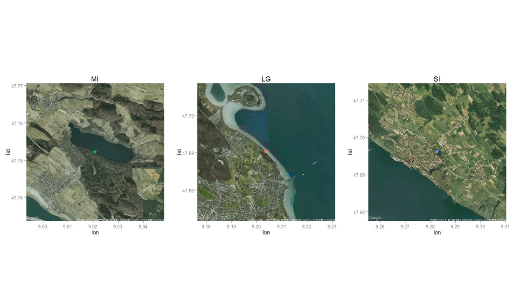

Overview of my work.
--------------------

You have an access to some final documents of what I have done (essentially from interships) since 2008. This is only to give you an idea of what I am able to do so far. If you need more information, do not hesitate to ask me (_cf_ contact in the Home page).

*   2017 - Making a new kinetic data variable available: the slope (HDC GmbH, Konstanz, BW, DE).​
*   2017 - Importance of documentation and Standard Operational Procedures (HDC GmbH, Konstanz, BW, DE).
*   2016 - HTS data processing and analysis. Example of possibilities with open source softwares (R) ​(HDC GmbH, Konstanz, BW,  DE).
*   2015 - Overview of tools developed with R ​(HDC GmbH, Konstanz, BW, DE).
*   2014 - Example of data analysis for quality control of Hight throughtput screening data ​(HDC GmbH, Konstanz, BW, DE).
*   2013 - Charged of data analysis (CNRS Chizé, Deux-Sèvres, FR).
*   2012 - Intership on bats and aquatic insect emergences (Limnological Institute, Konstanz, BW, DE).
*   2012 - Erasmus in Sweden (Gothenburg, SE).
*   2011 - Intership on bats (Cholet, Maine-et-Loire, FR)
*   2010 - Intership on the Little Owl (Chevreuse, Yevelines, FR).
*   2009 - Internship on Lady-beetles (Calais, Nord Pas-de-Calais,  FR).
*   2007-2008 - BTSA Forestry Management (Mirecourt, Vosges, FR).
*   Other - R graphics.

 2016 - HTS data processing and analysis. Example of possibilities with open source softwares (R) (HDC GmbH, Konstanz, BW, DE).

----------------------------------------------------------------------------------------------------------------------------------

**Data processing and reporting**: Creation of several highly flexibel functions for HTS data. All what is exposed here was done with home made R functions on a Rserver.
Content of the output similar to professional famous softwares (Genedata, IDBS:

*   Reporting
    *   Heatmaps (Matrix of heatmaps with in row 1 plate and in column a variable, scale per plate per variable or per variable - permit plate comparison and dispensing quality issue)
    *   Graphical representation of the evolution of QC data through a screen (troubleshooting and quality control issue)
    *   IC50 parameters and curve fitting exported in 1 spreadsheet or html with base64 graphics. All information for a Dose Response Curve Assay compiled in 1 file.
    *   Kinetic curves plots
    *   Scatterplot for Hit Confirmation or comparison of data for HCS (no limited number of variable)
    *   Import in database
*   Data processing
    *   Read from files or export from database
    *   Transform any raw data (as well kinetic data with 2 additions) into QC control data (Zprime-factor, Robust Zprime-factor, Signal to background, Signal to Noise, Stdev,  Mean, Median ....)
    *   Compound mapping
    *   IC50 calculation
*   Quality control
    *   Automatic data processing and analysis with automatic display of graphics in order to troubleshoot as fast as possible in case of problems

 

Example of kinetic data with 2 addition in DRC format. Curve fitting of the 2 additions, raw data kinetic graphic, IC50 exported in spreadsheet format, 1 compound per line. IC50 parameters calculated with R (compared with GraphPad Prism: identical).

 

Kinetic data with in background the ratio MaxMin or Max Background.

 

Comparison of data for 2 different Image analysis procedure (HCS). Vertical and Horizontal lines reprensent 1 to 4x the sd of the compound data. Usually used as a threshold for hit selection.

 

 

Comparison of data for 2 Sessions (duplicates).

 

Heatmap of n (number of rows) plates in 3 variables (columns).

 

Evolution of quality control parameters through a screen.

 

Scatterplot of data from a screen. Colors are the controls. Horizontal line represent the variation of the compounds (C, 1 to 4x SD) data. Permit to decide of threshold for hit selection as well as have a feeling of the robustness of the assay.

2015 - Overview of tools developed with R ​(HDC GmbH, Konstanz, BW, DE).
------------------------------------------------------------------------

*   **Quality control**
    *   Analysis of log files from robotic lines to extract real schedule time, errors, barcodes, time needed per device or movements, Echo dispenser information (make then plot of the logfiles of this device)
        *   Enhance programming, quality control and troubleshooting
    *   Analysis and tracking of the status of different compounds libraries (around 800 plates - volume left in the plate, number of times use for transfer, volume transferred, quantify evaporation rate...)
        *   Enhance quality of compound transfer
*   **Data mining**
    *   Extract all intensity information of .flex files (picture for Opera reader) and plot their distribution 
        *   Help to set thresholds for image analysis (segmentation)

 

Schedule Graphics created with the analysis of the logfile from 1 robotic line.

 

 

Status of a compound library (volume left, chronology from a plate, volume dispensed ...)

 

Echo logfile analysis. Permit to track quality control of the transfer (BC included in graph).

 

Density graphic (histogram) from the intensity of each field (image) from a well. Permit to see if some fields differ from the majority as well as to get an idea of the intensity distribution in the images

 

 

Display flex files (tiff from the Opera). 1 row per well.

2014 - Example of data analysis for quality control of Hight Throughtput Screening data (HDC GmbH, Konstanz, BW, DE).

------------------------------------------------------------------------------------------------------------------------

Example of the characteristics of the scripts created in R :

*   Basic user interface permitting non-familiar R user to use the scripts :
    \- choice of working directory
    \- creation of graphics or not
    \- filter for more detail analysis
    \- layout choice (positive and negative controls)
*   Various output data or logfiles from several readers or dispensers (Echo550, Trilux, Envision, Hamamatsu FDSS 3000, Polara software).
*   Mapping done from barcodes on output graphics and xls files (data readable by other scientist).
*   Graphics created : IC50 on each microplate from a screen, hitmaps, kinetic curves, summary graphics (Average, standard deviation, CV of positive and negative controls, Z-factor, signal to background).
*   Screen correction : as what the famous [Screener](https://www.genedata.com/products/screener/) software from Genedata is able to do. Look at the pattern of each plates and apply a correction factor to each well. Allow to correct dispensing error, reader effect ....

 

Distribution of the interval generated by kinetic data of wells per plate, depending on the controls.

 

Explanation of a screen correction calculation. Done with R.

 

Calculation of Dose response curves : 1 graph generated per plate and summary in xlsx. Allow to follow in detail the quality of the results over a screen.

 

Kinetic curves of wells , raw data function of the time. Red curves are non corrected values, black corrected.

2013 - Charged of data analysis (CNRS Chizé, Deux-Sèvres, FR).

-----------------------------------------------------------------

**Datas** : Commerson dolphins observations and identifications (also done by me).

*   Work with .gpx files
*   Analysis done with R, Mark, CloseTest. Report with knitr and Rstudio (R, LateX).
*   libraries used (igraph, ggplot2, sp, maptools, plyr, reshape2, rgdal, plotrix, grid, gridExtra, maps, mapdata, fields, Rcapture, knitr, base, catspec, fontcm, extrafont, xtable).
*   Spatial analysis with the help of [Pascal Monestiez](http://ciam.inra.fr/biosp/node/85).
*   Capture Mark Release Recapture analysis with  the help of [Christophe Barbraud](http://www.cebc.cnrs.fr/Fidentite/barbraud/barbraud.htm).

Example of graphics not available. Article in preparation.
 

2012 - Intership on bats and aquatic insect emergences (Limnological Institute Konstanz, BW, DE).

----------------------------------------------------------------------------------------------------

**Subject :** Seasonality and differences in **insect emergences** among 3 lakes around Constance (Germany) and their **influences on bat activity** between spring and early summer.

My report is not available since it will certainly contribute to a future scientific publication. However, the abstract and the bibliography used can be found [here](files/pdf/d.gravier_2012_intership_konstanz_bats_insects.pdf). 

I learned alone how to use R to create nice and interesting graphs as well as performing several statistical tests and manipulating dataframes. Some examples are exposed below with some information voluntary hidden (essentialy with libraries ggplot2, plyr, scales, grid, reshape, FactoMineR and ggmap).

 

 

 

 

 

 

 

 

2012 - Erasmus in Sweden (Gothenburg, SE).

---------------------------------------------

I had the opportunity to do an **Erasmus** in Sweden during winter 2011-12. There, I followed 2 courses :  Comparative Physiology of Marine Animals  and Primary Producers of the Sea.

I did a project work during 2 weeks in the first one concerning leptin receptors in the Rainbow trout. 
In the second one, I wrote a review concerning the **monitoring of green tides on the Brittany coast** (France). This one is available [here](files/pdf/gravier_-_2012_-_monitoring_of_green_tides_on_the_brittany_coasts_france.pdf).

2011 - Intership on bats (Cholet, Maine-et-Loire, FR).

---------------------------------------------------------

**Subject :** **Bats** roosts research and **protection** approaches

33 colonies found, 6 convention signed with owners of colony. Results are available [here](files/pdf/d.gravier_2011_intership_bats_results.pdf).
Example of organisation of a prospective week-end to find bats' roost, management of several volunteers : [pdf available](files/pdf/dorian-gravier_example_we-prosp_2011.pdf).

Example of analyzes and resulting map.
Explanations:

*   Map 1 : _cf _[this pdf](files/pdf/d.gravier_2011_intership_bats_map1_expla.pdf)
*   Map 2 : _cf _[Results of the internship report.](files/pdf/d.gravier_2011_intership_bats_results.pdf)

 

 

**Communication:**

 

 

 

2010 - Internship on the Little Owl (Chevreuse, Yvelines, FR).

-----------------------------------------------------------------

**Subject :** Elaboration of a **conservative plan** for preserving 2 little area with couples of **Little owls** (_Athena noctua_). 

A final report had to be given to my structure for which I was working. The approach was quite new and was quite turned on "research". The idea was to try to find the best reproductive area for this species, to know why, and at the same time to prioritize where to put action and how for the future (increase perch to enhance his hunting, increase tanks preys ....). 

You can have an idea of the final report given to the [Regional Nature Parc of the Haute Vallée de Chevreuse](http://www.parc-naturel-chevreuse.fr/) here ([Part 1](files/pdf/dorian-gravier_part-report_pnrhvc_2010_1.pdf) & [Part 2](assets/dorian-gravier_part-report_pnrhvc_2010_2.pdf)) with the map provided here.

Example of map created for the conservative plan. Those are concerning the ideas that we proposed on prioritize area for the species). 

 

 

 

2009 - Internship on Lady-beetles (Calais, Nord Pas-de-Calais, FR).

----------------------------------------------------------------------

**Subject **: Participation to a **lady-beetles atlas** of the Pas-de-Calais (France).

This internship was quietly only field work. I had a certain area to prospect to find the maximum of lady-beetles species. First use of Arc gis by my own wishes. You can have a look to the [short results](files/pdf/dorian-gravier_results_2009_atlas_ladybeetles.pdf).

2007-2008 - BTSA Forestry Management (Mirecourt, Vosges, FR).

----------------------------------------------------------------

Synthesis of the work done : [available here](files/ppdf/btsa-gf_dorian-gravier_synthese_stage.pdf).

Other - R graphics.

----------------------

Some other examples of graphic done with R (essentialy with libraries ggplot2, plyr, scales, grid, reshape, lattice and ggmap).

 

 

 

 

 

 
