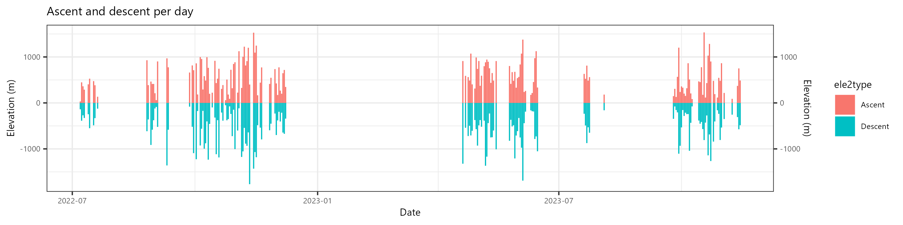

<html>
	<head>
	
	<title>A Leaflet map!</title>
	
	
	<!-- Browserify	 --> 
    	<!--  -->

	<!-- leaflet -->
    	<link rel="stylesheet" href="../assets/js/node_modules/leaflet/dist/leaflet.css" />
    	

    	<!-- gpx.min -->
    	<!-- Copyright (C) 2013 Maxime Petazzoni <maxime.petazzoni@bulix.org> -->
    	<!--  -->
    	

	<!-- Legend -->
	<link rel="stylesheet" href="../assets/js/Personal/leaflet.legend.css" />
    

	<!-- hash -->
	<!-- A JavaScript library that keeps track of the history of changes to the hash part in the address bar. -->
    	

    	<!-- fullscreen -->
	<!-- Not in npm -->
    	
    	<link href="../assets/js/node_modules/leaflet.fullscreen/Control.FullScreen.css" rel='stylesheet' />

    	<!-- GeoJSON.Ajax -->
	<!-- to update with https://www.npmjs.com/package/leaflet-ajax -->
	<!-- to update with https://www.npmjs.com/package/leaflet-ajax -->
	<!-- to update with https://www.npmjs.com/package/leaflet-ajax -->
	<!-- to update with https://www.npmjs.com/package/leaflet-ajax -->
	<!-- to update with https://www.npmjs.com/package/leaflet-ajax -->
	<!-- to update with https://www.npmjs.com/package/leaflet-ajax -->
	<!-- to update with https://www.npmjs.com/package/leaflet-ajax -->
	<!-- to update with https://www.npmjs.com/package/leaflet-ajax -->
	<!-- to update with https://www.npmjs.com/package/leaflet-ajax -->
    	<link  href="../assets/js/GeoJSON.Ajax/GeoJSON.Style.css" rel="stylesheet" />
    	
    	
    	

	<!-- Minimap -->
	<!-- https://github.com/Norkart/Leaflet-MiniMap
	Copyright (c) 2012, Norkart AS
	All rights reserved. -->
	
	<link  href="../assets/js/node_modules/leaflet-minimap/src/Control.MiniMap.css" rel="stylesheet"/>

	<!-- topcenter -->
	<!-- Not in npm -->
	<!-- Not in npm -->
	<link  href="../assets/js/topcenter/leaflet-control-topcenter.css" rel="stylesheet"/>
	

	<!-- geocoder -->
	<link rel="stylesheet" href="../assets/js/node_modules/leaflet-control-geocoder/dist/Control.Geocoder.css" />
	

	<!-- leaflet-routing-machine -->
	<!-- browserify leaflet-routing-machine.js -o leaflet-routing-machine2.js -->
	<!--  -->
	<!-- <link rel="stylesheet" href="../assets/js/node_modules/leaflet-routing-machine/dist/leaflet-routing-machine.css" /> -->

	<!-- lrm-graphhopper -->
	<!-- Run in cmd: -->
	<!-- C:\Users\doria\Downloads\GitHub\dorian.gravier.github.io\js\node_modules\lrm-graphhopper\src > browserify L.Routing.GraphHopper.js -o L.Routing.GraphHopper2.js -->
	<!--  -->

	<!-- FileLayer -->
	
	
	<!-- Leaflet.PolylineMeasure -->
	<link rel="stylesheet" href="https://ppete2.github.io/Leaflet.PolylineMeasure/Leaflet.PolylineMeasure.css" />
	
	<!-- need those to download track -->
	
	

    	<!-- Personal js -->
    	<!--  -->
    	<!--  -->
    	
    	
    	

    	

    </head>
    <body>

    	 
    	<!-- To display the map -->
    	

    	 
    	 

    	
	
 

	 
	
<iframe src="../assets/images/BikeTrip2022/text.txt" frameBorder="0"></iframe>

	 
	

	 
	

	 
	

	 

    </body>

</html>

[{: .align-center width="10%"}](https://www.youtube.com/@oYoLibro)

<a href="https://www.youtube.com/@oYoLibro">All the youtube videos here</a>

Software used to create all of this:

- Video
	- [Losslesscut](https://mifi.github.io/lossless-cut/) to cut the video
	- [FFmpeg](https://ffmpeg.org/)
	- [Gpx-animator](https://gpx-animator.app/)
		- I used once [gpxfaketimer](https://github.com/mikaello/gpxfaketimer) to add some fake timestamp to use in gpx-animator
	- [youtube-dl]() for the music
	- [mpv](https://mpv.io/) as player and with some [lua scripts](../files/Batch/Lua) that I wrote to calling some batch files easily (see below)
	- Batch files that I created ([here](..files/Batch/FFmpeg))
	- lua scripts that I created for mpv ([mpv-easyblur](https://github.com/DGrv/mpv-easyblur))
	- for subtitles
		- [whisper-faster](https://github.com/Purfview/whisper-standalone-win)
- Map
	- [leaflet](https://github.com/Leaflet/Leaflet) and a lot other addon
		- **to finish**
	- [GPSBabel](https://www.gpsbabel.org/) to work on the gpx
	- [gpx_reduce](https://github.com/Alezy80/gpx_reduce) with the original author [here](https://wiki.openstreetmap.org/wiki/User:Travelling_salesman/gpx_reduce) to clean the gpx
	- Batch files that I created ([here](..files/Batch/Gpx))
- Graphics
	- [R](https://www.r-project.org/)
- Planning
	- [gpx.studio](https://gpx.studio/)
	- [Locus Android app](https://www.locusmap.app/) with the incredible [OpenAndroMaps](https://www.openandromaps.org/en)

<html>
 
</html>

