# Skills and competences

You can here have a look at a pretty detailed learning experience and knowledge obtained since I am studying ecology and working as a Robotic Engineer (only in English).  You will find this as a summary in my CV below.

[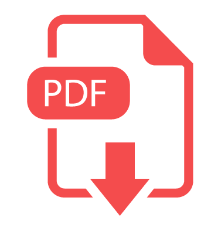{: .align-center width="10%"}](../files/pdf/201906_CV_dgrv.pdf)

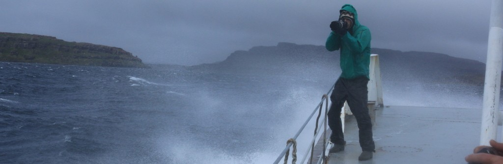{: .align-center}

# What am I actually doing ?

Actually working as an Data Analyst & HTS Robotic Specialist in a private pharmaceutical company ([HDC GmbH](http://hit-discovery.de/index.php?id=2) in Konstanz, Germany). We are providing services regarding High-Throughput Screening ([HTS](http://en.wikipedia.org/wiki/High-throughput_screening)), High-Content Screening ([HCS](https://en.wikipedia.org/wiki/High-content_screening)) and compound management.

As responsible of 4 robotic lines, my tasks are relatively diverse, from programming robots, complete data processing and analysis (with [R](https://www.r-project.org/) mainly) of the company (complete data analysis workflows and solution build from the scratch), optimising robotic and working workflows, assay development regarding automation, quality control of results and troubleshooting, maintenance of all the devices (liquid handling, robots, incubators …).

Without having studied this engineering and biotechnology field, the challenge has been to start from 0 and this in different areas in a new created company without having expert to support me. My experience acquired during my career is based on several skills that I consider valuable and that I am constantly trying to improve. High adaptation and autonomie capabilities, looking for organisational work  and responsibilities, focus on communication and team spirit, interest in problem solving and process optimisation are the one that speak me the most. ​

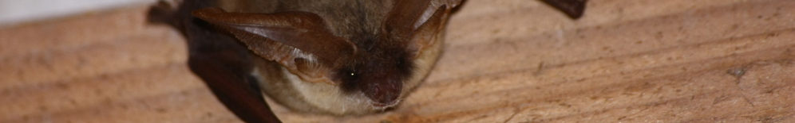{: .align-center}

# Languages

- French (mother tongue).
- English (fluent in speaking and writing).
  - Daily use since 2011, Erasmus in Sweden, Master Thesis in Germany, work in Germany).
- German (fluent in speaking and writing).
  - Daily use since 2015, B2 Diplome, used at work and in private life.

# Computer science

I have really **good abilities** in computer science. Learning fast and usually alone, I am enjoying solving problems and optimising workflows by discovering new solutions, creating them from scratch or combining them with good ideas from others.  I like to have a broad picture of how and why I am working as well as having fun to go in the details. I found of critics and feedback. Personal and professional development is what I am looking for everyday.

The best example of all of this is for sure my actual job where I learned from scratch everything. I can today described my self as a Data Analyst and HTS Robotic Specialist. All what I learned in computer science there was directed to improve quality, efficiency, flexibility, reproducibility, robustness.

I love bringing the power of computer science in a team via communication. This allow a team to work together for a more efficient, reliable, fun and reproducible work. 

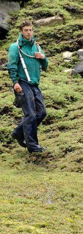{: .align-left} 

- **R** : Daily usage since 2013 and high skills
  - *​Data mining, to reporting, standardised functions developed since years *
  - *HTS and HCS data analysis all under standardised flexible workflows (Quality Control, Normalisation, Correction, curve fitting, IC50, hit criteria selection, automatic reporting in html-excel-with-graphics, plateview representation from HCS data, automatic log files processing, graphical representation from single point to kinetic data, robot schedule hacking, database import, export, mapping …)*
  - *You can get an idea of what I am able to here : [R analysis](portofolio.html).*
- Reproducible research - report via **Rmarkdown**, **R Notebooks**, experience in **LateX. **
- Usage of different computer languages or command line-interface :
  - **C#, VBS, Html, bash** and **cmd,** **SQL**
- Daily usage of [mindmap](https://en.wikipedia.org/wiki/Mind_map) and diagram tools.
- High experience in GIS,  in **ArcGi**s (Example on the Little owl), Qgis.
- Used sound software for bat calls analyzing (Batsound, bcAdmin with BatIdent, Avisoft SasLab pro, package seewave on R …).
- High use of [Zotero](http://www.zotero.org/) (software for managing references and documents). 
- High skills in office suites in general (Office or LibreOffice)
- Experience in dynamic presentation : [ImpressJS](https://github.com/impress/impress.js/)

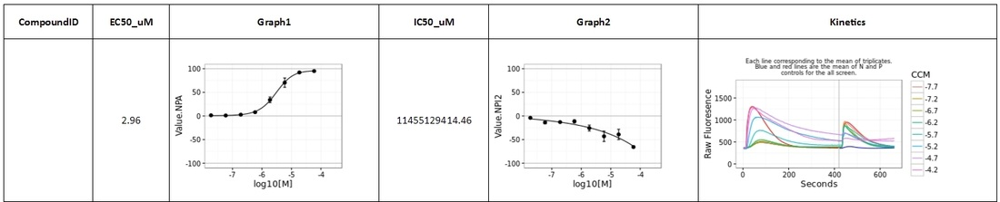{: .align-center}

# Robotic

**Responsible of 4 robotic lines** at [HDC GmbH](https://www.hit-discovery.com/de/start/) (Konstanz Germany) I am responsible of all what turns around automation  :

- programming and optimisingprotocols (timing, precision, robustness …)
- calibration of dispensers and readers
- assay transfer into automation
- maintenance of devices and robots
- expertise regarding automation workflow
- quality control
- troubleshooting

**Lines:**

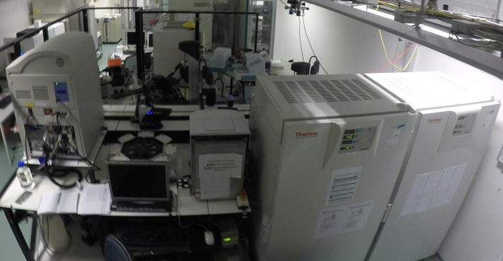{: .align-center width="50%"}
- Thermo line
  - Dimension 4 System
  - Silvermax controllers
  - Polara v2.3
- Robocon lines (2x and one build from scratch without support)
  - C500C controller with CataLyst-5 or A255 arm
  - Robolab 3 Plus, v3.17 for Windows NT
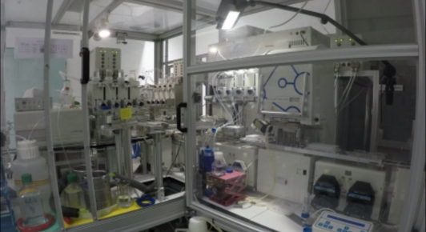{: .align-center width="50%"}
- Cybio line
  - Cybio-Control v3.2
  - Cybio-Scheduler v2.0

**Example of devices used in the lines:**

- First generation of Opera reader (microscope from PerkinElmer), Evoshell v1.8.1
- Envision readers (PerkinElmer)
- Cybi-vario and Cybi-well (Cybio)
- Multidrops384 and Combidrops (Thermo Scientific)
- Incubators (Heraus 6000-6002, Cytomat24)
- Echo555 (Labcyte)
- ​Hamamatsu FDSS6000

**Types of assay run:**

- Cell-based assays (HTS and HCS)
  - ​Luminescence and Fluorescence
- ​​Biochemical Assays
  - ​Scintillation Proximity Assays (SPA) radioative assay (HTS)
  - ​Enzymatic assays

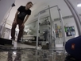
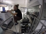
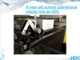

# Bats

**Skills**

- Identification of individuals in hand, in summer roosts or during winter when hibernation .
- Experience in **acoustic identification** (thousand of calls analyzed in 2012), from Pipistrellus, Myotis and Eptesicus-Nyctalus.
- Catching of bats with mist nets and unravelling.
- Important bibliography collected during 3 years (scientific and gray).

**Involved in project :**

- 2015 - Co-Author in a talk presented by Ioanna Salvarina at the ASLOAquatic Sciences Meeting :
  - Salvarina I, **Gravier D** & Rothhaupt K-O (2015) Aquatic-terrestrial connectivity: lakes as food sources for bats. ASLO Aquatic Sciences Meeting, Granada, Spain. ([Link to abstract](http://www.sgmeet.com/aslo/granada2015/viewabstract.asp?AbstractID=27156)).
- 2014 - Help in **data analysis** and comments provided for the redaction of **scientific articles**:
  - Salvarina I., **Gravier D**. and Rothhaupt K. 2015 (submitted – Journal of mammology). Seasonal bat activity related to insect emergence at three temperate lakes.
  - Salvarina I., **Gravier D**. and Rothhaupt K. (In preparation). Seasonal bat activity related to insect emergence at three temperate lakes.
- 2012 - Co-Author in a talk presented by Ioanna Salvarina at the ASLO Aquatic Sciences Meeting : 
  - Salvarina I, Yohannes E, **Gravier D** & Rothhaupt K-O (2012) Aquatic subsidies (emerging insects) to terrestrial consumers (bats). ASLO Aquatic Sciences Meeting. Lake Biwa, Shiga, Japan. ([Link to abstract](https://www.sgmeet.com/aslo/japan2012/viewabstract2.asp?AbstractID=9716)).
- 2012 - March to August - **Subject:** Seasonality and differences in insect emergences among 3 lakes around Constance (Germany) and their influences on bat activity between spring and early summer - Intership with the Limnological Institute in Konstanz - This master thesis has resulted in **3 talks** at the university of Metz, at the university of Konstanz and at the Max Planck for Ornithology of Möggingen.
  - Recordings with the [batcorder from EcoObs](http://www.ecoobs.com/cnt-batcorder.html).
  - Acoustic identification of thousand sequences.
- 2012 - June - Collaboration to a talk presented by [Ioanna Salvarina](http://www.orn.mpg.de/207307/Ioanna_Salvarina) at the [ALSO Aquatic science meeting](https://www.sgmeet.com/aslo/japan2012/viewabstract2.asp?AbstractID=9716). **Subject:** Aquatic subsidies   (emerging insects) to terrestrial consumers (bats).
- 2012 - March - Participation to [the national French meeting on bats](http://www.museum-bourges.net/chauve-souris-rencontres-sfepm-81.html) at Bourges (France).
- 2011 - March to August - **Subject: **Bats roosts research and protection approaches **- Intership** during 6 month with the [CPIE Loire et Mauges](http://www.cpie.paysdesmauges.fr/) *(supervisor : Loïc Bellion) -* 6 months \_-\_Supplementary information.
  - Research alone of roosting sites : prioritization of building to visit, contacting and planning meeting, communication with  collectivities, discussion and awareness of owners.
  - Organisation of a prospective week-end with volunteers.
  - Several catching with specialists (Loic Bellion, Benjamin Même-Lafond, David Sayer …).
  - Radiotracking : during nights for feeding territories with *Myotis emarginatus* and day for roosts.           
- 2011 - January & February - Participation at approximatly 5 entire **winter prospection** week-end with the association [CPEPESC Lorraine](http://www.cpepesc-lorraine.fr/) in Lorraine (France).

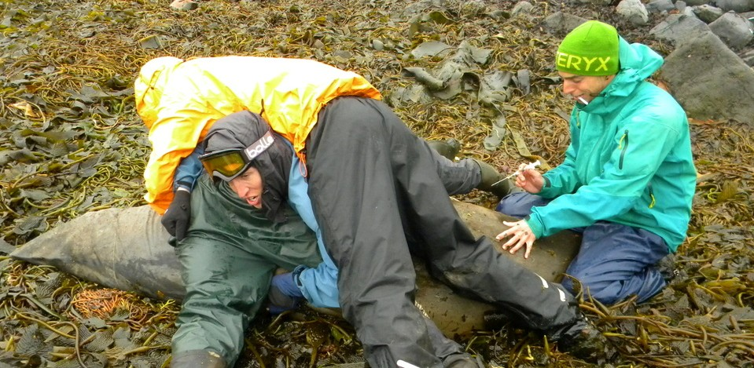{: .align-center}

# Mammals in general

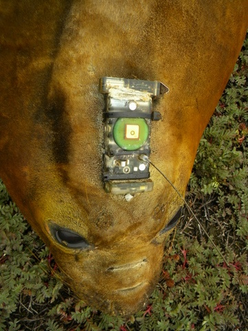{: .align-right width="30%"}

**Competences**

- Tags set-up on and off on elephant seals
- Photo-identification (done on Commerson dolphins (*Cephalorhynchus commersonii*) - **first try in the world**)

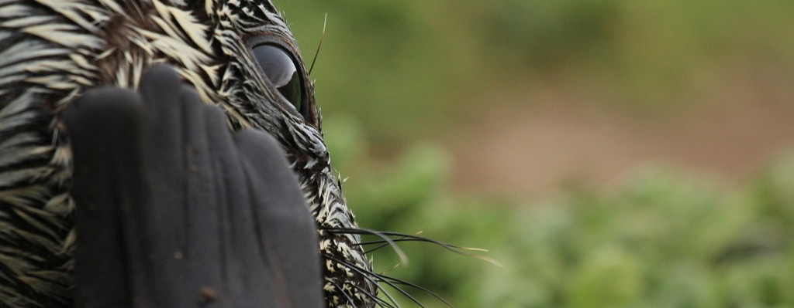{: .align-center}

**Involved in project :**

- 2012/2013 - 4 months :
  - **Centre National de la Recherche Scientifique** of Chizé on biologic studies, **Data analysis** (R), Distribution, spatial usage, isotope analysis, Commerson dolphins (Cephalorhynchus commersonii) sociality from Kerguelen island. (Contact: christophe.guinet@cebc.cnrs.fr et paul.tixier@taaf.re)
  - **National Nature Reserve** of French Austral islands in Kerguelen. Charged of **Commerson dolphins’ monitoring**. Help the CNRS of Chizé for setting-up on and off tags on elephant seals.

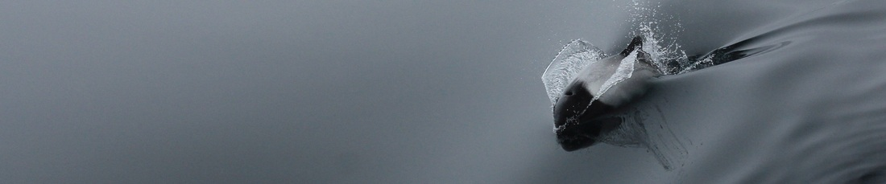{: .align-center} 

# Birds

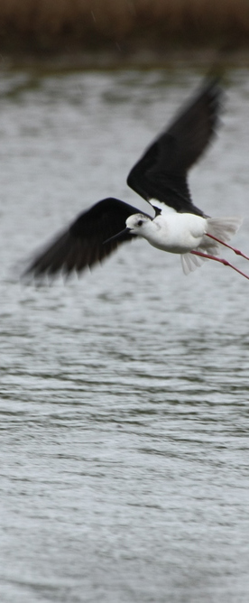{: .align-left} 

**Competences**

- Basic knowledge in visual identifications of mid-european birds.
- Experience in catching birds in Japan nets.
- Beginner in songs of common birds.

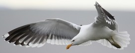{: .align-center} 

**Participation**

- 2012 - 3 days of catchings birds with the Max Planck Institute for Ornithology at the [Vogelwarte Radolfzell Ringing Centre](http://www.euring.org/meetings/general_assemblies/kollum_2001/scheme_reports_01/radolfzell_report.htm), supervised by [Dr W.Fielder](http://cms.uni-konstanz.de/wikelski/mitarbeiter-am-lehrstuhl/wissenschaftliche-mitarbeiter/dr-wolfgang-fiedler/).
- 2010 - August - 1 week of formation for catching birds in the [Alsacian little Camargue reserve](http://www.petitecamarguealsacienne.com/web/).
- 2009-2010 - Several days of catching with different specialists in ringing birds.
- 2010 - April to August - **Intership** during 5 months with the Regional Natural Parc, Haute Vallée de Chevreuse (*supervisor : Alexandre Mari*). Subject : Elaboration of an actions plan to conserve two **Little owl** population and monitoring of nesting boxes.

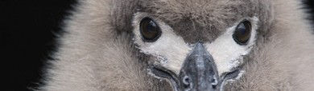{: .align-right} 

# Other contributions

**Mammals:**

- Participation to prospective days (2009-2010) with the [GEML](http://www.geml.fr/) to evaluate the population of European beaver (*Castor fiber*), and regular transfer of own data to this association.

**Botanic:** 

- Essentially forest plants knowledge, acquired during my BTSA (2006-2008).   

**Insects:** 

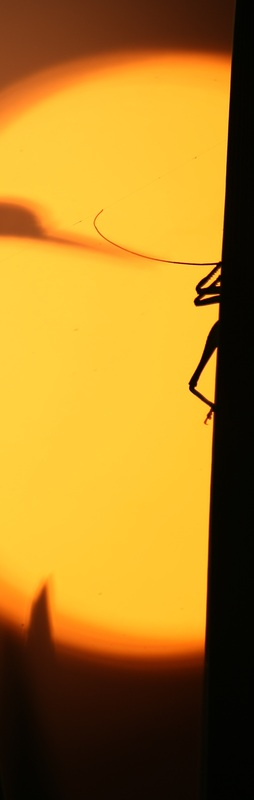{: .align-left width="20%"}

- 2012 - Identification of aquatic emerged insects and terrestrial flying and walking insects at family level for Diptera species, related to  internship in the Limnological Institute (2nd master thesis).
- 2009 - Research and identification of Coccinellidae of north of France during my internship in 2009.

# Presentations

- 2013 - Mai : Presentation of first analysis on Commerson dolphins’ datas recolted at Kerguelen island. CNRS Chizé. *Chizé - France.*
- 2013 - April : Why studying the Commerson dolphins’ population of Kerguelen ? First results. RNN TAF. Limnological Institute of *Konstanz - Germany*
- **2013 - March** : Why studying the Commerson dolphins’ population of Kerguelen ? First results. RNN TAF. *On the Marion Dusfrene boat, somewhere in the Indian Ocean.*
- **2012 - December** : Studying Commerson dolphins at Kerguelen, what does it mean ? RNN TAF. *Port-aux-Français - Kerguelen.*
- 2012 - September : Seasonality and differences in insect emergences among 3 lakes around Constance (Germany) and their influences on bat activity between spring and early summer - Intership with the Limnological Institute in Konstanz - ***3 talks** at the university of Metz, at the university of Konstanz and at the Max Planck for Ornithology of Moggingen.*
- **2012 - January and April** : Review : Monitoring of green tides on the Brittany coasts (France). ERASMUS in Sweden with Gothenburg University. *Gothenburg - Sweden and Konstanz - Germany.*
- 2011 - October : Localization of leptin receptors in rainbow trout brain revealed by immunohistochemical method. ERASMUS in Sweden with Gothenburg University.\_ Gothenburg - Sweden.\_
- **2011 - August** : Recherche et démarches de protection de colonies de chauves-souris dans les Mauges (49). M2 CRB. *Metz - France.*
- **2010 - June** : Elaboration d’une méthodologie descriptive des habitats potentiels pour la Chevêche d’Athéna (*Athene noctua)* préalable à la mise en œuvre d’un plan d’actions pour la conservation d’un noyau de population. M1 CRB. *Metz - France.*

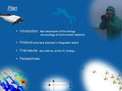{: .align-center}

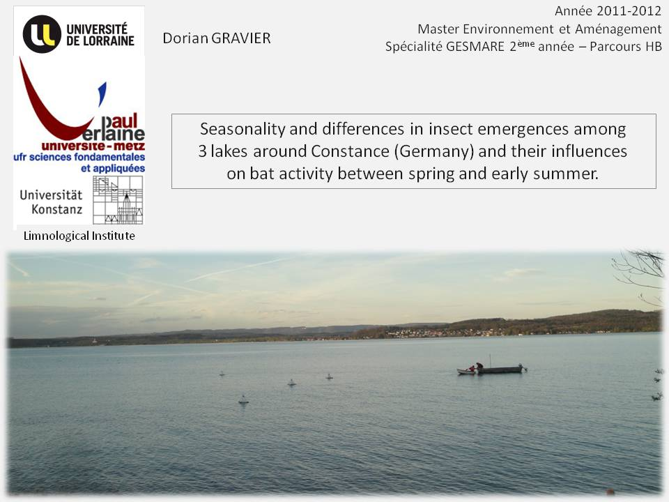{: .align-center width="50%"}

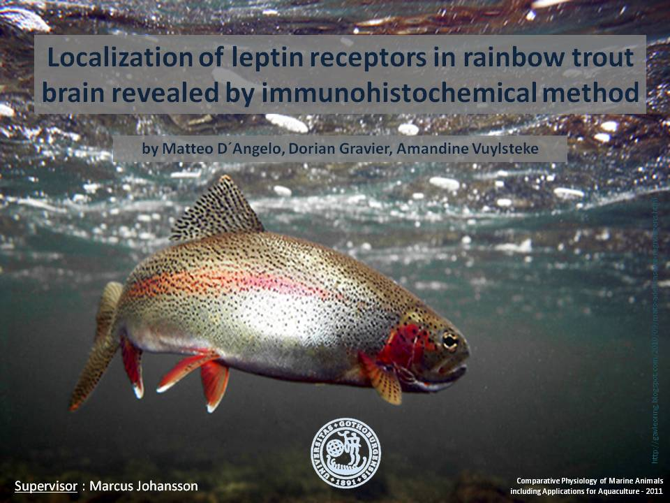{: .align-center width="50%"}

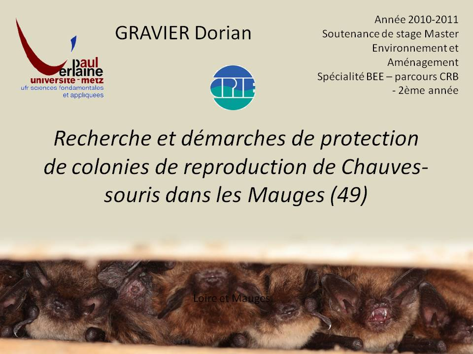{: .align-center width="50%"}
