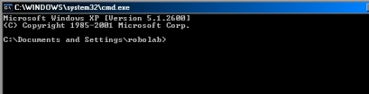

# Delete files via a regex

- Open the batch file
- Give the path in string
- Give your regex
- The batch will print the list of file and tell you how many file it will delete, ask user yes or no

``` shell
@echo off

set /p dirpath=Where are your files ?
:: set dirpath=%~dp0 :: if you want to use the directory where the batch file is
set /p pattern=Which pattern do you wanna search (use regex: *.xml e.g.) :
:: combinason /s /b for fullpath+filename, /b for filename
for /f %%A in ('dir /s /b "%dirpath%\%pattern%" ^| find /v /c ""') do set cnt=%%A
echo File count = %cnt%

call :MsgBox "Do you want to delete all %pattern% in %dirpath%? %cnt% files found"  "VBYesNo+VBQuestion" "Click yes to delete the %pattern%"
if errorlevel 7 (
    echo NO - quit the batch file
) else if errorlevel 6 (
    echo YES - delete the files
    :: set you regex, %%i in batch file, % in cmd
    for /f "delims=" %%a in ('dir /s /b "%dirpath%\%pattern%"') do del "%%a"
)

:: avoid little window to popup
exit /b

:: VBS code for the yesNo popup
:MsgBox prompt type title
    setlocal enableextensions
    set "tempFile=%temp%\%~nx0.%random%%random%%random%vbs.tmp"
    >"%tempFile%" echo(WScript.Quit msgBox("%~1",%~2,"%~3") & cscript //nologo //e:vbscript "%tempFile%"
    set "exitCode=%errorlevel%" & del "%tempFile%" >nul 2>nul
    endlocal & exit /b %exitCode%
```

# Change color console

I created a batch file to change the color of the windows cmd windows. It is using [Ansicon](https://github.com/adoxa/ansicon). The goal is to make the console a bit more clear: You can see you self the difference :

 

The batch file is checking which OS you have:

- 32 or 64bits, to know which .exe to install
- XP or above, to adapt the way to write the ‘promptx’ variable

The only things that you have to do is adapt where you exe is and if needed change the color and the output in the prompt : “$e[1;31m$p$s$e\[1;34m$g$s\$e\[1;37m”

\]

``` shell
reg Query "HKLM\Hardware\Description\System\CentralProcessor\0" | find /i "x86" > NUL && set OS=32BIT || set OS=64BIT
systeminfo | findstr /B /C:"OS Name" /C:"OS Version" | find /i "XP" > NUL && set ver=XP || set ver=other
if %OS%==32BIT (
    if exist H:\ (
        H:
        H:\TEMP\Software\ansi186\x86\ansicon.exe -i
    ) else (
        X:
        X:\TEMP\Software\ansi186\x86\ansicon.exe -i
    )
)
if %OS%==64BIT (
    if exist H:\ (
        H:
        H:\TEMP\Software\ansi186\x64\ansicon.exe -i
    ) else (
        X:
        X:\TEMP\Software\ansi186\x64\ansicon.exe -i
    )
)

if %ver%==XP (
    reg add HKCU\Environment /v PROMPT /d "$e[1;31m$p$s$e[1;34m$g$s$e[1;37m" /f
) else (
    setx prompt $e[1;31m$p$s$e[1;34m$g$s$e[1;37m
)
```

# Get system info

## OS bits

``` shell
reg Query "HKLM\Hardware\Description\System\CentralProcessor\0" | find /i "x86" > NUL && set OS=32BIT || set OS=64BIT
if %OS%==32BIT (
    echo 32bits
) else (
    echo 64bits
)
```

## OS version

``` shell
systeminfo | findstr /B /C:"OS Name" /C:"OS Version" | find /i "XP" > NUL && set ver=XP || set ver=other
echo %ver%
```

## Format date or time

If the input locale is englisch the month and day are reversed. Here a solution to get it right.

``` shell
systeminfo | findstr /B /C:"Input Locale:" | find /i "de;" > NUL && set lan=de || set lan=en
if %lan%==de (
    set month=%date:~-7,2%
    set day=%date:~-10,2%
) else (
    set day=%date:~-7,2%
    set month=%date:~-10,2%
)
```

## Get timestamp

``` shell
:: ---------- Find Time ----------
set hour=%time:~0,2%
if "%hour:~0,1%" == " " set hour=0%hour:~1,1%
set min=%time:~3,2%
if "%min:~0,1%" == " " set min=0%min:~1,1%
::set secs=%time:~6,2%
::if "%secs:~0,1%" == " " set secs=0%secs:~1,1%

set year=%date:~-4%
systeminfo | findstr /B /C:"Input Locale:" | find /i "de;" > NUL && set lan=de || set lan=en
if %lan%==de (
    set month=%date:~-7,2%
    set day=%date:~-10,2%
) else (
    set day=%date:~-7,2%
    set month=%date:~-10,2%
)
if "%month:~0,1%" == " " set month=0%month:~1,1%
if "%day:~0,1%" == " " set day=0%day:~1,1%
set datetimef=%year%%month%%day%%hour%%min%
```

# Magick

## Merge in batch

MAGICK_Merge_Vertical_jpg-png_v02.bat

``` shell
@echo off
SETLOCAL ENABLEDELAYEDEXPANSION

set /p which="Do you want to merge jpg (type 1) or png (type 2) ? : "

if %which%==1 set format="jpg"
if %which%==2 set format="png"

set /p per=percent to resize (numeric) (make a copy it will overwrite your files)?:

echo Choose where your jpg are (choose 1 file):


:: file choose and get dir
set dialog="about:<input type=file id=FILE><script>FILE.click();new ActiveXObject
set dialog=%dialog%('Scripting.FileSystemObject').GetStandardStream(1).WriteLine(FILE.value);
set dialog=%dialog%close();resizeTo(0,0);</script>"

for /f "tokens=* delims=" %%p in ('mshta.exe %dialog%') do set "input=%%p"
for /F %%i in ("%input%") do @set dir=%%~dpi
for /F %%i in ("%input%") do @set drive=%%~di

%drive%
cd "%dir%"

:: give info on what will be done
dir /a-d /b "*%format%" | find /c %format% > temp
set /p nfiles= < temp
::set /a nfiles=nfiles
del temp

:: resize
for %%p in (*.%format%) do magick convert %%p -resize %per%%% %%p


:: Merge
magick montage *.%format% -tile 1x%nfiles% -geometry +0+0 Merge.%format%
magick convert Merge.%format% Merge.pdf

echo DEBUG --------------------------
echo drive %drive%
echo dir %dir%
echo which %which%
echo format %format%
echo magick montage *.%format% -tile 1x%nfiles% -geometry +0+0 Merge.%format%
echo magick convert Merge.%format% Merge.pdf
```

## Resize in batch

MAGICK_Resize_v01.bat

``` shell
@echo off
SETLOCAL ENABLEDELAYEDEXPANSION

set /p which="Do you want to merge jpg (type 1) or png (type 2) ? : "

if %which%==1 set format="jpg"
if %which%==2 set format="png"

set /p per=percent to resize (numeric) ?:

echo Choose where your files are (choose 1 file):

:: file choose and get dir
set dialog="about:<input type=file id=FILE><script>FILE.click();new ActiveXObject
set dialog=%dialog%('Scripting.FileSystemObject').GetStandardStream(1).WriteLine(FILE.value);
set dialog=%dialog%close();resizeTo(0,0);</script>"

for /f "tokens=* delims=" %%p in ('mshta.exe %dialog%') do set "input=%%p"
for /F %%i in ("%input%") do @set dir=%%~dpi
for /F %%i in ("%input%") do @set drive=%%~di

%drive%
cd "%dir%"

:: give info on what will be done
dir /a-d /b "*%format%" | find /c %format% > temp
set /p nfiles= < temp
::set /a nfiles=nfiles
del temp

for %%p in (*.%format%) do magick convert %%p -resize %per%%% %%~np_low.%format%

```

## Level brightness

``` shell
@echo off
SETLOCAL ENABLEDELAYEDEXPANSION

echo Choose where your jpg files are (choose 1 jpg):

:: file choose and get dir
set dialog="about:<input type=file id=FILE><script>FILE.click();new ActiveXObject
set dialog=%dialog%('Scripting.FileSystemObject').GetStandardStream(1).WriteLine(FILE.value);
set dialog=%dialog%close();resizeTo(0,0);</script>"

for /f "tokens=* delims=" %%p in ('mshta.exe %dialog%') do set "input=%%p"
for /F %%i in ("%input%") do @set dir=%%~dpi
for /F %%i in ("%input%") do @set drive=%%~di

%drive%
cd %dir%


:: User input number of channel

set /p channel="At which level do you wanna set the white point ? (20 mean 20 percent of the actual, just test and MAKE A COPY OF YOUR FILE) : "
set /a channel=channel

:: give info on what will be done
dir /a-d /b "*jpg" | find /c "jpg" > temp
set /p nfiles= < temp
set /a nfiles=nfiles
set /a xfile=1
del temp

set /p tt=%nfiles% jpg will be processed, type Enter to continue.


:: convert in tiff and rename it
FOR /F "delims=" %%a IN ('dir /a-d /b "*jpg"') DO (
    H:\TEMP\Software\ImageMagick-7.0.8-Q16\magick.exe convert %%a -level "0%%,%channel%%%,1" %%a
    echo 1 more done ...
)
```

## flex files to tiff

``` shell
@echo off
SETLOCAL ENABLEDELAYEDEXPANSION

echo Choose where your flex files are (choose 1 flex):

:: file choose and get dir
set dialog="about:<input type=file id=FILE><script>FILE.click();new ActiveXObject
set dialog=%dialog%('Scripting.FileSystemObject').GetStandardStream(1).WriteLine(FILE.value);
set dialog=%dialog%close();resizeTo(0,0);</script>"

for /f "tokens=* delims=" %%p in ('mshta.exe %dialog%') do set "input=%%p"
for /F %%i in ("%input%") do @set dir=%%~dpi
for /F %%i in ("%input%") do @set drive=%%~di

%drive%
cd %dir%
mkdir TIFF

:: User input number of channel

set /p channel="How many Channel you have ? "
set /a channel=channel

:: give info on what will be done
dir /a-d /b "*flex" | find /c "flex" > temp
set /p nfiles= < temp
set /a nfiles=nfiles
set /a xfile=1
del temp

set /p tt=%nfiles% flex will be processed, type Enter to continue.


:: convert in tiff and rename it
FOR /F "delims=" %%a IN ('dir /a-d /b "*flex"') DO (
    H:\TEMP\Software\ImageMagick-7.0.8-Q16\magick.exe convert %%a -set filename:f "%%t_%%s" +adjoin "TIFF\%%[filename:f].tif"
    dir /b "*.tif" | find /c "%%~na" > temp
    set /p howmany= < temp
    set /a howmany=!howmany!
    del temp
    set /a loopfi=howmany/channel
    :: order dir by date /od
    cd TIFF
    FOR /F "delims=" %%b IN ('dir /a-d /b /od "%%~na*tif"') DO (
        FOR /l %%c IN (1, 1, !loopfi!) DO (
            FOR /l %%d IN (1, 1, %channel%) DO (
                ren %%b TIFF\%%~na_ch%%d_fi%%c.tif

            )
        )
    )
    cd ..
    echo !xfile! flex / !nfiles!
)

```

